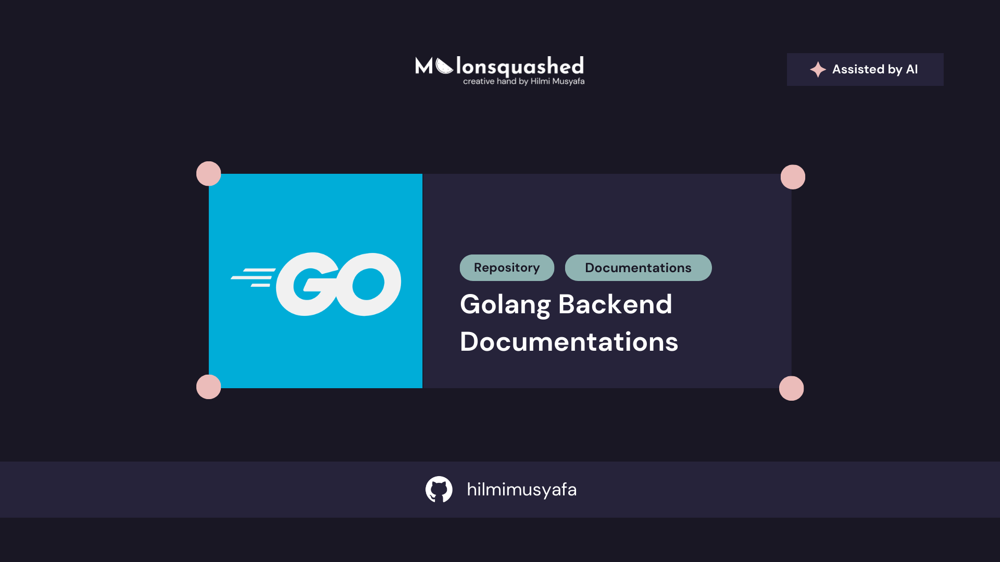

# Golang Backend



## Description
This repository contains comprehensive documentation and examples for Golang backend development. It is a personal project aimed at providing clear and concise explanations of various Go programming concepts, backend development patterns, and best practices. This repository is perfect for learning backend development with Go.

**Note :** Some content in this repository is generated with the assistance of AI tools to enhance learning materials and provide comprehensive explanations.

## Features

- Detailed explanations of Golang backend concepts
- Code examples for better understanding
- RESTful API implementations
- Database integration examples
- Organized by topics and categories
- Easy navigation through documentation
- Real-world backend project examples

## Reference 

- [Go Official Documentation](https://go.dev/doc/)
- [Gin Official Documentation](https://gin-gonic.com/en/docs)

## Contents

This repository is organized by chapters:

- Chapter 1 : Introduction Backend and Go
- Chapter 2 : Gin Framework Fundamentals

## Prerequisites

Before working with the code in this repository, ensure you have the following installed on your system:

- [Go](https://go.dev/dl/) (version 1.20 or later recommended)
- [Gin](https://gin-gonic.com/)
- [Git](https://git-scm.com/)
- A text editor or Integrated Development Environment (IDE) like VSCode, GoLand, or Vim with Go plugins
- [PostgreSQL](https://www.postgresql.org/) or [MySQL](https://www.mysql.com/) (for database examples)
- [Postman](https://www.postman.com/) or similar API testing tool (optional)

## Getting Started

To get started with this repository, follow these steps:

1. **Clone the Repository**
    ```bash
    git clone https://github.com/hilmimusyafa/golang-backend.git
    cd golang-backend
    ```

2. **Set Up Go Environment** :
    Ensure your Go environment is set up correctly by checking your Go installation:
    ```bash
    go version
    ```

3. **Install Dependencies** :
    Navigate to a specific project directory and install the required dependencies:
    ```bash
    go mod download
    ```

4. **Run the Code** :
    Navigate to the respective project or chapter directory and run the Go code. For example:
    ```bash
    cd "Chapter 1 - Introduction to Go"
    go run main.go
    ```

5. **Build the Project** (optional) :
    To compile the project into an executable:
    ```bash
    go build -o app main.go
    ./app
    ```


## Running Tests

To run tests for any module :

```bash
go test ./...
```

For verbose output:

```bash
go test -v ./...
```

## AI-Assisted Learning Notice

This repository documents my personal learning journey in Go backend development.

AI tools are used as learning assistants to help generate explanations, draft examples, and explore different implementation approaches. However, all materials are carefully reviewed, validated, and refined as part of my study process.

My Learning Approach

- I read and analyze all AI-assisted content.
- I review and modify code to ensure deep understanding.
- I test implementations independently.
- I cross-reference with the official Go documentation.
- I adapt examples to fit real-world backend scenarios.

This repository represents an active learning process — not automated content dumping.

## Important Notes

All code examples are intended for educational purposes. Before using any code in production:

- Perform security reviews.
- Test thoroughly.
- Validate against official documentation.
- Ensure compliance with relevant licenses.

AI is used as a tool — learning and understanding remain the primary goal.

## Contributing

If you would like to contribute to this repository, please follow these guidelines :

1. Fork the repository and create your branch from `main`.
2. Ensure any new code is well-documented and follows Go conventions and best practices.
3. Write tests for new functionality.
4. Ensure all tests pass before submitting.
5. Create a pull request and describe the changes you've made.

## Contact

For questions or suggestions, feel free to reach out:
- GitHub : [@hilmimusyafa](https://github.com/hilmimusyafa)
- Instagram : [@hilmimusyafa](https://instagram.com/hilmimusyafa)