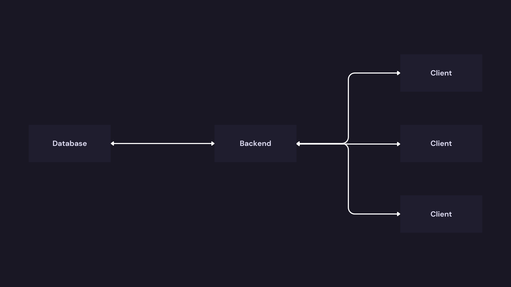

# Bab 1 : Perkenalan Backend dan Go

## 1.1 Apa itu Backend Development

### 1.1.1 Konsep Backend

Aplikasi modern, baik itu mobile app (seperti Gojek) maupun web app (seperti Tokopedia), tidak mungkin menyimpan semua data produk, riwayat transaksi, atau data pengguna langsung di dalam memori HP atau laptop penggunanya. Selain memakan ruang penyimpanan yang sangat besar, hal ini juga sangat berbahaya dari sisi keamanan. Di sinilah peran krusial sebuah sistem pusat untuk mengatur lalu lintas data, menjalankan aturan bisnis, dan menjaga keamanan informasi. Sistem pusat inilah yang disebut sebagai Backend.



Untuk memahami konsep ini dengan mudah, bayangkan sebuah restoran skala besar :

- Frontend (Aplikasi di HP/Browser) : Ini adalah ruang makan restoran. Ada buku menu yang indah, meja yang tertata rapi, dan pelayan yang ramah. Pengunjung berinteraksi langsung dengan bagian ini.
- Backend (Server, Database, API) : Ini adalah Dapur Tertutup di belakang restoran. Di sana terdapat koki yang memasak (Logika Bisnis/Server), kulkas raksasa penyimpan bahan baku (Database), dan sistem manajemen pesanan agar tidak ada makanan yang tertukar (API/Routing).

Pengunjung restoran tidak perlu tahu bagaimana cara koki memotong sayur atau di laci mana daging disimpan. Pengunjung hanya perlu memesan Nasi Goreng (Kirim Request), lalu menunggu pelayan membawa sepiring Nasi Goreng matang (Terima Response).

### 1.1.2 Cara Kerja Secara Sederhana

Siklus kerja backend berputar pada dua aktivitas utama yaitu Request (Permintaan) dan Response (Jawaban).

- Request datang : Aplikasi klien mengirimkan permintaan via internet. (Contoh: "Tolong tampilkan daftar sepatu sneakers").
- Validasi & Proses : Server menerima permintaan tersebut, mengecek apakah permintaan valid, lalu mengambil data sepatu sneakers dari dalam Database.
- Kirim Response : Server mengemas data sepatu tersebut ke dalam format baku (biasanya berformat JSON - sebuah format teks ringan pembawa data) dan mengirimkannya kembali ke aplikasi klien.
- Tampilan : Aplikasi klien menerima data JSON tersebut dan menggambarnya menjadi gambar sepatu, nama produk, dan harga di layar HP.

### 1.1.3 Implementasi dengan Code Example

Berikut adalah wujud nyata sebuah "dapur" sederhana menggunakan Golang. Kode ini akan membuat sebuah server yang siap menerima pesanan dan mengembalikan data berformat JSON.

1.1.3-1-BasicBackendServer.go

```go
package main

import (
	"encoding/json"
	"log"
	"net/http"
)

// ResponseData adalah cetakan (struct) untuk bentuk data yang akan dikirim
type ResponseData struct {
	Message string `json:"message"`
	Status  int    `json:"status"`
}

func main() {
	// 1. Membuat endpoint (Daftar Menu di Restoran)
	http.HandleFunc("/api/greetings", func(w http.ResponseWriter, r *http.Request) {
		// Set header agar pemesan (client) tahu bahwa paket yang datang berisi JSON
		w.Header().Set("Content-Type", "application/json")

		// 2. Siapkan data yang akan dikirim (Memasak pesanan)
		data := ResponseData{
			Message: "Hello! Order successfully processed by Backend.",
			Status:  200, // 200 adalah kode standar internet untuk "OK/Sukses"
		}

		// 3. Ubah struktur data Go menjadi JSON dan kirimkan (Menyajikan makanan)
		err := json.NewEncoder(w).Encode(data)
		if err != nil {
			http.Error(w, err.Error(), http.StatusInternalServerError)
			return
		}
	})

	// 4. Menyalakan mesin restoran
	log.Println("Backend Server starts running on port 8080...")
	
	// Server akan terus menyala dan mendengarkan request di port 8080
	err := http.ListenAndServe(":8080", nil)
	if err != nil {
		log.Fatal("Server failed to start : ", err)
	}
}
```

Kode bisa di akses di [1.1.3-1-BasicBackendServer.go](../../codes/1/1.1.3/1.1.3-1-BasicBackendServer.go)

Untuk menggunakan kode tersebut, jalankan dengan go di terminal.

```bash
go run 1.1.3-1-BasicBackendServer.go
```

Lalu buka browser internet, kunjungi : http://localhost:8080/api/salam. Dan ini untuk breakdown Penjelasan Kode : 

- `package main` dan `import` : Baris wajib agar program Go bisa dieksekusi sebagai aplikasi. Di sini digunakan package bawaan Go yaitu net/http untuk membuat server internet, dan encoding/json untuk mengubah data menjadi format JSON.
- `type ResponseData struct` : Ini adalah fondasi pembentukan data di Golang. Tag `json:"message"` berfungsi sebagai instruksi agar saat diubah menjadi JSON, variabel Message akan ditulis dengan huruf kecil message.
- `http.HandleFunc("/api/salam", ...)` : Fungsi ini mendaftarkan sebuah jalur URL (sering disebut Endpoint). Ibarat menambahkan item baru di buku menu restoran. Segala permintaan yang masuk ke alamat /api/salam akan ditangani oleh blok kode di dalam fungsi ini.
- `w.Header().Set(...)` : Header adalah informasi tersembunyi yang disisipkan dalam paket pengiriman. Mengatur `Content-Type `ke `application/json` sangat krusial agar aplikasi klien tidak kebingungan membaca data yang datang.
- `json.NewEncoder(w).Encode(data)` : Proses menerjemahkan objek struct `ResponseData` murni bawaan Golang menjadi teks JSON universal, sekaligus langsung menuliskannya ke jalur Response (w).
- `http.ListenAndServe(":8080", nil)` : Fungsi utama yang menyalakan mesin server. Angka 8080 adalah nomor "pintu" (Port) tempat server berjaga menunggu tamu (Request) yang datang.

## 1.2 Kenapa Golang untuk Backend?

### 1.2.1 Primadona Baru di Backend


Memilih bahasa pemrograman untuk backend ibarat memilih jenis pondasi untuk gedung pencakar langit. Jika salah perhitungan, saat jumlah pengguna aplikasi membludak (lalu lintas data tinggi), server bisa kelebihan beban (crash) atau tagihan sewa cloud server akan membengkak drastis. Golang (atau Go) diciptakan oleh Google pada tahun 2009 khusus untuk menyelesaikan masalah skalabilitas di era modern ini.

Kekuatan utama Go terletak pada tiga pilar : 
- Performance (Kecepatan)
- Concurrency (Kemampuan menjalankan banyak tugas bersamaan)
- Simplicity (Kesederhanaan penulisan kode).

Untuk memahami keunggulan Concurrency Go, bayangkan operasional sebuah restoran cepat saji :

- Bahasa Tradisional (seperti PHP/Python awal) : Ibarat 1 kasir melayani 1 pelanggan dari awal pesan, ke dapur, sampai makanan disajikan. Antrean lain harus menunggu (lambat).
- Node.js : Ibarat 1 kasir super cepat yang hanya mencatat pesanan lalu melemparnya ke dapur, lalu lanjut mencatat pesanan berikutnya. Sangat efisien, tapi jika kasir ini pingsan (proses utama terhenti), seluruh restoran lumpuh.
- Java : Ibarat mempekerjakan banyak kasir sekaligus, tapi setiap kasir menuntut meja kerja yang sangat besar dan mewah. Pekerjaan cepat selesai, tapi sangat boros memori (RAM) dan biaya operasional.
- Golang : Ibarat memiliki kemampuan untuk menciptakan ribuan kasir virtual (Goroutine) dalam sekejap. Kasir-kasir ini sangat ringan, tidak butuh meja besar, dan bisa bekerja secara paralel. Begitu tugas selesai, mereka langsung menghilang untuk menghemat sumber daya.

### 1.2.2 Ekosistem Go di Indonesia

Ekosistem Go di Indonesia Di Indonesia, Go adalah "bahasa wajib" bagi perusahaan rintisan berstatus Unicorn ke atas :

- Gojek : Menggunakan Go sebagai tulang punggung utama untuk menangani jutaan permintaan booking per detik dengan jeda (latency) yang sangat rendah.
- Tokopedia : Telah memigrasikan banyak layanan inti mereka dari Perl dan Node.js ke Go, yang terbukti secara drastis menghemat biaya server dan mempercepat response time.
- Bukalapak, Traveloka, Ruangguru : Secara ekstensif menggunakan Go untuk membangun arsitektur Microservices mereka. Ekosistem dan komunitas Go di Indonesia sangat matang, diiringi dengan permintaan industri yang tinggi untuk posisi Go Backend Developer.

## 1.3 Backend Architecture

Mengapa memahami arsitektur backend sangat penting? Menulis kode hanyalah sebagian kecil dari pekerjaan seorang Backend Developer. Bagian tersulitnya adalah memastikan kode tersebut tidak hancur saat diakses oleh puluhan ribu pengguna secara bersamaan. Arsitektur backend adalah cetak biru (blueprint) yang menentukan bagaimana berbagai komponen perangkat lunak berinteraksi untuk menciptakan sistem yang cepat, aman, tangguh (reliable), dan siap untuk lingkungan produksi (production-ready).

Tanpa arsitektur yang benar, sebuah aplikasi mungkin berjalan mulus saat diuji coba, tetapi akan mengalami kelumpuhan total (downtime) saat dirilis ke publik.

### 1.3.1 Komponen Utama Arsitektur Backend

#### 1.3.3.1 Client-Server Model & Request-Response 

Cycle Ini adalah hukum dasar komunikasi di internet. Client (bisa berupa aplikasi mobile, browser web, atau mesin IoT) selalu menjadi pihak yang memulai komunikasi dengan mengirimkan Request (permintaan). Server (mesin backend) mendengarkan permintaan tersebut, memproses datanya, dan mengirimkan kembali Response (jawaban). Server murni bertindak pasif menunggu request datang.

#### 1.3.3.2 API Concepts (REST, GraphQL, gRPC) 

API (Application Programming Interface) adalah cara client dan server saling mengerti. Terdapat beberapa gaya desain API :

- **REST (Representational State Transfer)** : Paling populer. Menggunakan metode HTTP standar (GET untuk mengambil, POST untuk mengirim, PUT untuk mengubah, DELETE untuk menghapus). Sifatnya seperti memesan "Paket Menu A", formatnya baku dan mudah dipahami.
- **GraphQL** : Diciptakan oleh Facebook. Memungkinkan client untuk meminta data secara sangat spesifik. Ibarat memesan burger dan secara spesifik mengatakan "hanya roti, daging ganda, tanpa saus". Ini mencegah pengambilan data yang berlebihan (over-fetching).
- **gRPC** : Diciptakan oleh Google. Sangat cepat karena menggunakan format biner (Protobuf), bukan teks murni seperti JSON. Biasanya tidak dipakai untuk komunikasi Client-Server publik, melainkan untuk komunikasi antar server di internal backend (microservices architecture), ibarat komunikasi radio antar staf dapur.

#### 1.3.3.3 Database 

Role Database adalah Source of Truth (sumber kebenaran). Server backend bersifat stateless (tidak menyimpan ingatan permanen). Jika mesin server dimatikan, memori di dalamnya hilang. Oleh karena itu, semua data penting (informasi pengguna, saldo, riwayat transaksi) harus disimpan secara permanen di Database, baik yang relasional seperti PostgreSQL, maupun non-relasional seperti MongoDB.

#### 1.3.3.4 Caching Layer 

Mengambil data dari database itu proses yang "mahal" (membutuhkan waktu pencarian dan tenaga pemrosesan komputer). Caching Layer (seperti Redis atau Memcached) adalah memori sementara berkecepatan sangat tinggi. Jika ada data yang sering diminta (misalnya: daftar produk terpopuler di halaman depan aplikasi), data tersebut disimpan di Cache. Server akan memeriksa Cache terlebih dahulu. Jika ada (Cache Hit), data langsung dikembalikan. Jika tidak ada (Cache Miss), server baru akan mencarinya di Database.

#### 1.3.3.5 Load Balancer & Scaling 

Ketika jumlah pengguna membludak, satu mesin server akan kewalahan dan mati (crash). Solusinya adalah Scaling (memperbesar kapasitas). Ada dua cara: Vertical Scaling (memperbesar RAM/CPU pada server yang sama) atau Horizontal Scaling (menambah jumlah mesin server menjadi banyak). Jika menggunakan Horizontal Scaling, dibutuhkan Load Balancer di posisi paling depan untuk mendistribusikan lalu lintas request secara merata ke puluhan atau ratusan mesin server tersebut.

## 1.4 Go Refresher

Mengapa perlu melakukan review singkat ini? Golang memiliki sintaks yang sangat sederhana, tetapi kesederhanaan tersebut menyimpan kekuatan besar jika digunakan dengan pola yang tepat. Dalam pengembangan backend, menulis kode yang sekadar "jalan" tidaklah cukup. Kode harus efisien secara memori, aman dari kebobolan data, dan mudah di- maintain (dipelihara) oleh tim.

Bagian ini akan menyegarkan kembali ingatan tentang fitur-fitur inti Golang dan, yang paling penting, mengapa fitur tersebut sangat krusial dalam konteks pembuatan sistem backend skala produksi. Sesuai catatan, bagian ini akan menggunakan potongan-potongan kode (snippets) yang berfokus pada inti konsep.

### 1.4.1 Structs & Interfaces (Jantung Arsitektur Backend)

Ini penting karena backend pada dasarnya adalah pabrik pengolah data. Data dari database atau dari client harus memiliki bentuk yang jelas. Struct adalah cetakan untuk bentuk data tersebut. Sedangkan Interface adalah kontrak perilaku. Interface memungkinkan pembuatan sistem yang decoupled (tidak saling ketergantungan erat), sehingga database PostgreSQL bisa diganti menjadi MySQL esok hari tanpa harus merombak seluruh logika bisnis.

Analogi : Struct adalah formulir pendaftaran kosong yang harus diisi dengan format spesifik (Nama, Umur, Alamat). Interface adalah lowongan pekerjaan bertuliskan "Dicari: Tukang Masak". Tidak peduli siapa orangnya (entah itu Budi atau Siti), selama dia memiliki method `Masak()`, dia bisa mengisi posisi tersebut.

```go
package main

import "fmt"

// 1. Struct: Representasi data di tabel database
type User struct {
	ID    int
	Name  string
	Email string
}

// 2. Interface: Kontrak yang harus dipenuhi oleh penyimpanan data mana pun
type UserRepository interface {
	Save(user User) error
}

// 3. Implementasi Interface (Bisa untuk PostgreSQL, MySQL, atau sekadar memori sementara)
type PostgresRepo struct{}

// PostgresRepo secara otomatis memenuhi UserRepository karena memiliki method Save
func (p PostgresRepo) Save(user User) error {
	fmt.Println("Saving", user.Name, "to PostgreSQL database...")
	return nil
}
```

Best Practice: Selalu terima Interface sebagai parameter, dan kembalikan Struct sebagai hasil balasan. Ini membuat kode sangat mudah diuji (Unit Testing).

### 1.4.2 Pointers dalam Konteks Backend

Saat menangani request berukuran besar (misalnya payload JSON berisi ribuan baris data), menyalin data tersebut dari satu fungsi ke fungsi lain akan membuat memori server cepat habis (Out of Memory). Pointer menyelesaikan masalah ini dengan hanya memberikan "alamat rumah" dari data tersebut, bukan membangun ulang rumahnya. Selain itu, Pointer wajib digunakan jika ingin mengubah nilai asli dari suatu variabel (mutasi state).

Analogi : Membagikan tautan (link) Google Docs kepada rekan kerja (Pointer). Semua orang mengedit dokumen yang sama, dan perubahannya langsung terlihat. Menggunakan Value (tanpa pointer) ibarat mencetak dokumen ke kertas dan membagikannya; jika satu orang mencoret-coret kertasnya, kertas orang lain tidak akan berubah.

```go
package main

import "fmt"

type Product struct {
	Name  string
	Price float64
}

// Menggunakan pointer (*) agar bisa mengubah harga asli di memori
func ApplyDiscount(p *Product, discount float64) {
	p.Price = p.Price - (p.Price * discount)
}

func main() {
	laptop := Product{Name: "Laptop Pro", Price: 1000.0}
	
	// Mengirim alamat memori menggunakan ampersand (&)
	ApplyDiscount(&laptop, 0.20) 
	
	// Harga laptop sekarang menjadi 800.0
	fmt.Printf("Price after discount: %.2f\n", laptop.Price) 
}
```

### 1.4.3 Error Handling Patterns

Golang tidak memiliki `try-catch` seperti bahasa lain. Error diperlakukan sebagai nilai (value) biasa yang dikembalikan oleh sebuah fungsi. Dalam backend, mengabaikan error adalah dosa besar. Jika database gagal menyimpan data pembayaran tetapi error-nya diabaikan, pelanggan akan mengira transaksinya berhasil padahal uangnya melayang.

Analogi : Melihat lampu indikator "Check Engine" menyala di dasbor mobil. Jangan menempelkan lakban hitam untuk menutupinya (mengabaikan error). Segera minggir dan periksa apa yang salah sebelum mesin meledak.

```go
package main

import (
	"errors"
	"fmt"
)

// Fungsi yang mengembalikan dua nilai: hasil dan error
func FindUser(id int) (string, error) {
	if id <= 0 {
		// Membuat error baru yang informatif
		return "", errors.New("User ID not valid, must be greater than 0")
	}
	return "Secret User Data", nil
}

func main() {
	data, err := FindUser(-5)
	
	// Pattern paling umum di Golang: periksa error langsung setelah fungsi dipanggil
	if err != nil {
		fmt.Println("There is an error :", err)
		return // Hentikan eksekusi, jangan paksakan lanjut
	}
	
	fmt.Println("Data founded :", data)
}
```

### 1.4.4 Goroutines & Channels Basics

Kekuatan utama Golang ada di sini, yaitu di Concurrency (konkurensi). Saat server harus memproses 10.000 request detik ini juga, Goroutines memungkinkan program menjalankan ribuan tugas secara bersamaan tanpa membebani sistem operasi. Sedangkan Channels adalah pipa komunikasi agar goroutines tersebut bisa bertukar data tanpa bertabrakan (Race Condition).

Analogi : Goroutines adalah menambah jumlah koki di dapur. Channels adalah ban berjalan (conveyor belt) tempat koki A meletakkan roti yang sudah dipanggang, agar bisa diambil dengan aman oleh koki B yang bertugas memberi saus.

```go
package main

import (
	"fmt"
	"time"
)

// Simulasi tugas berat: Mengirim email notifikasi
func SendEmail(email string, doneChan chan bool) {
	fmt.Println("Starting sending email to", email, "...")
	time.Sleep(2 * time.Second) // Simulasi waktu proses 2 detik
	fmt.Println("Email sended to", email)
	
	doneChan <- true // Mengirim sinyal ke channel bahwa tugas selesai
}

func main() {
	// Membuat channel bertipe boolean
	done := make(chan bool)

	// Kata kunci 'go' menjalankan fungsi di background (Goroutine baru)
	go SendEmail("customer@example.com", done)

	fmt.Println("Server didn't blocked, can do other work...")
	
	<-done // Menunggu (blocking) sampai ada data yang masuk ke channel
	fmt.Println("All processes are running.")
}
```

Use Case di Backend, biasanya mengunggah foto ke Cloud Storage tidak boleh membuat request client tertunda (loading terus-menerus). Jalankan proses upload tersebut di dalam Goroutine sebagai background job.

### 1.4.5 Packages & Modules

Mengapa ini penting? Proyek backend yang matang tidak mungkin hanya terdiri dari satu file `main.go`. Kode harus dipecah menjadi puluhan file dan dikelompokkan berdasarkan fungsinya (misalnya folder `handlers`, `models`, `database`). Modules (`go.mod`) adalah pengelola versi dari proyek, memastikan jika menggunakan library versi 1.2 hari ini, proyek tidak akan rusak jika bulan depan library tersebut update ke versi 2.0.

Cara Kerja Sederhana :

- Jalankan `go mod init nama-proyek` (Membuat "KTP" untuk proyek).
- Gunakan huruf kapital di awal nama fungsi/variabel (`func GetUser()`) agar bisa diakses dari package (folder) lain. Ini disebut sifat Exported (Public). Jika huruf kecil (`func getUser()`), ia hanya bisa dipakai di dalam package itu sendiri (Private).

### 1.4.6 Go Standard Library Tour

Filosofi Golang adalah "Batteries Included". Berbeda dengan bahasa lain yang mengharuskan instalasi framework berat untuk sekadar membuat web server, Golang sudah menyediakannya di dalam Standard Library (perpustakaan bawaan). Pengembang backend wajib menguasai 3 paket utama ini :

- `net/http` : Mesin utama untuk membangun server HTTP, menerima request, mengatur header, dan mengirim balasan.
- `encoding/json` : Jembatan bahasa. Frontend dan Backend mengobrol menggunakan format teks JSON. Paket ini men- translate teks JSON menjadi Struct Golang, dan sebaliknya.
- `database/sql` : Penghubung ke semua jenis database relasional.

Contoh integrasi memproses JSON dari Client :

```go
package main

import (
	"encoding/json"
	"fmt"
)

type LoginRequest struct {
	Username string `json:"username"`
	Password string `json:"password"`
}

func main() {
	// Simulasi data JSON yang dikirim dari Frontend
	jsonData := []byte(`{"username": "admin", "password": "secretpassword"}`)

	var req LoginRequest
	
	// Unmarshal: Menerjemahkan JSON text ke dalam Struct Golang (menggunakan pointer)
	err := json.Unmarshal(jsonData, &req)
	if err != nil {
		fmt.Println("Failed read JSON:", err)
		return
	}

	fmt.Printf("Try login by user : %s\n", req.Username)
}
```

Mengingat kembali konsep-konsep ini adalah bekal yang sangat krusial. Saat melangkah ke bab-bab selanjutnya untuk membangun arsitektur dan API yang nyata, elemen-elemen dari Struct, Pointer, hingga `net/http` ini akan digunakan hampir di setiap baris kode.

## 1.5 Development Environment Setup

Banyak developer pemula meremehkan tahap ini. Akibatnya, di tengah jalan mereka mengalami masalah aneh seperti "package not found", "debugger not working", atau kode berjalan di komputer lokal tapi hancur saat di-deploy ke server. Lingkungan pengembangan (environment) yang tertata rapi akan meningkatkan produktivitas Anda hingga 2x lipat dan meminimalisir stres akibat konfigurasi.

### 1.5.1 Go Installation & Workspace

Tentu saja, dibutuhkan compiler Go untuk menerjemahkan kode yang ditulis agar dimengerti oleh mesin. Namun, yang lebih penting adalah memahami bagaimana Go mengelola dependensi proyek.

Dulu, Go sangat kaku dengan konsep `GOPATH` (semua proyek harus ada di satu folder khusus). Sekarang, menggunakan Go Modules. Ini memungkinkan membuat proyek di folder mana saja di komputer.

Langkah Instalasi :

1. Kunjungi situs resmi go.dev/dl.
2. Unduh installer sesuai sistem operasi (Windows/macOS/Linux).
3. Jalankan instalasi (Next -> Next -> Finish).

Verifikasi : Buka terminal/CMD, ketik perintah berikut:

```bash
go version
```

Output yang diharapkan : 

```
go version go1.25.6 X:nodwarf5 linux/amd64
```

Setup Workspace Proyek, Setiap kali memulai proyek baru, biasakan melakukan inisialisasi modul.

```bash
# Buat folder proyek
mkdir my-backend-app
cd my-backend-app

# Inisialisasi Go Modules
go mod init github.com/username/my-backend-app
```

File `go.mod` akan terbentuk. Ini adalah "KTP" dari proyek yang mencatat semua library yang digunakan nanti.

### 1.5.2 IDE Setup (The Cockpit)

Menulis kode di Notepad bisa dilakukan, tapi menyiksa. IDE (Integrated Development Environment) memberikan fitur Syntax Highlighting (pewarnaan kode), Auto-completion (saran kode otomatis), dan Debugging (melacak bug). Bisa jadi :

- Visual Studio Code
- JetBrains Goland

### 1.5.3 API Testing Tools (Postman / Insomnia)

Browser (Chrome/Firefox) secara bawaan hanya mudah melakukan request tipe `GET` (mengambil data). Sebagai Backend Developer, harus menguji endpoint untuk `POST` (kirim data), `PUT` (update), dan `DELETE`. Juga perlu mengirim JSON body dan Header khusus.

Analoginya, jika Backend adalah dapur restoran, API Testing Tool adalah "Food Critic" yang mencicipi makanan sebelum disajikan ke pelanggan (Frontend). API Testing seperti : 

- Postman
- ApiDog
- Insomnia

### 1.5.4 Database Tools (GUI Client)

Melihat data lewat terminal (CLI) itu keren, tapi tidak efisien untuk debugging cepat. Database GUI Client membantu melihat isi tabel, relasi antar data, dan menjalankan query SQL dengan visualisasi yang enak dipandang. Rekomendasi : 

- DBeaver
- pgAdmin
- Beekeeper Studio

### 1.5.5 Git Setup & GitHub

Jangan pernah menamai file `backend_final_v3_beneran_fix.go`. Git adalah mesin waktu. Jika kode error parah hari ini, bisa kembali ke kondisi kode kemarin sore dengan satu perintah. GitHub adalah tempat menyimpan kode tersebut di awan (cloud) agar aman dan bisa dikerjakan bersama tim.

Untuk awal memulai bisa jalankan perintah : 

```bash
git config --global user.name "Name"
git config --global user.email "email@domain.com"
```

> Penting : `.gitignore` untuk Golang File `.gitignore` memberi tahu Git file mana yang **TIDAK BOLEH** di-upload (misalnya file rahasia atau file sampah hasil kompilasi).

Buat file bernama `.gitignore` di root folder proyek, isi dengan :

```
# Binaries (Hasil build)
*.exe
*.exe~
*.dll
*.so
*.dylib
bin/

# Environment Variables (Sangat PENTING agar password tidak bocor)
.env

# IDE Specific files
.vscode/
.idea/
```

## 1.6 Backend Development Workflow

Menjadi seorang Backend Developer profesional bukan hanya soal menulis kode yang bisa jalan. Ini soal disiplin.

Bayangkan dua orang koki. Koki A memasak di dapur yang berantakan, bahan berserakan, dan mencicipi masakan langsung dari panci panas. Koki B bekerja di stasiun kerja yang bersih, memiliki resep standar, mencatat setiap perubahan bumbu, dan memiliki tim pencicip khusus.

Siapa yang masakannya akan konsisten enak dan aman? Tentu Koki B.

Subbab ini akan membahas bagaimana membangun "dapur profesional" sendiri, atau yang disebut Development Workflow.

### 1.6.1 Local Development Environment (Dapur Uji Coba)

Di lingkungan lokal, semua bisa dilakukan, bisa menghancurkan database, mematikan server, dan melakukan eksperimen gila tanpa merugikan pengguna asli. Namun, tantangan terbesar backend developer adalah Repetisi. Mengubah satu baris kode, mematikan server (Ctrl+C), lalu menyalakannya lagi (`go run main.go`) ratusan kali sehari itu sangat melelahkan.

- Solusi : Live Reloading butuh alat yang otomatis mendeteksi perubahan file dan me-restart server secara instan.
- Tools : Air (Live reload for Go apps).
- Cara Setup : Jalankan perintah ini di terminal : 

```bash
go install github.com/air-verse/air@latest
```

Sekarang, alih-alih mengetik `go run main.go`, cukup ketik `air` di terminal root proyek. Setiap kali menekan Save (Ctrl+S), server akan restart otomatis dalam hitungan milidetik!

### 1.6.2 Version Control Workflow (Jaring Pengaman)

Jangan pernah bekerja langsung di branch main (atau master). Itu seperti memperbaiki mesin pesawat saat pesawatnya sedang terbang membawa penumpang.

The Feature Branch Workflow, ya ini adalah standar industri yang wajib ikuti :

- Main/Master: Kode yang stabil, siap produksi (Sacred/Suci).
- Feature Branch: Tempat Anda bekerja.

Alur Kerja :

- Buat Cabang Baru : Saat ingin membuat fitur Login, buat cabang baru `git checkout -b feature/user-login`
- Coding & Commit : Lakukan pekerjaan di sini.
- Push : Kirim ke GitHub.
- Pull Request (PR): Minta rekan tim (atau diri sendiri) me-review kode tersebut.
- Merge : Jika sudah oke, baru digabungkan ke main.

### 1.6.3 Debugging Tools & Techniques (Detektif Kode)

Mengapa ini penting? Banyak pemula menggunakan teknik "Print Debugging" (menaburkan `fmt.Println("masuk sini")` di mana-mana). Ini tidak salah, tapi sangat lambat dan mengotori kode.

Solusi : Delve & VS Code Debugger Gunakan fitur Breakpoint. Bayangkan bisa membekukan waktu (pause program) tepat saat error terjadi, lalu memeriksa isi variabel satu per satu.

Cara Pakai di VS Code :

- Klik di sebelah kiri nomor baris kode (muncul titik merah). Ini adalah Breakpoint.
- Tekan F5 (Start Debugging).
- Lakukan request ke API.
- VS Code akan otomatis berhenti di titik merah tersebut. bisa melihat nilai variabel password, email, dll saat itu juga tanpa perlu Print.

### 1.6.4 Logging Practices (Kotak Hitam Pesawat)

Mengapa ini penting? Saat aplikasi sudah di-deploy ke server produksi, Anda tidak bisa melihat layar terminalnya. Jika aplikasi crash atau error, satu-satunya cara mengetahui penyebabnya adalah lewat Log. Log adalah "kotak hitam" yang merekam kejadian sebelum kecelakaan.

Best Practice: Jangan gunakan fmt.Println untuk logging di produksi! Gunakan Structured Logging (Format JSON) agar mudah dibaca oleh mesin/software monitoring.

Di sini akan menggunakan package standar Go yang baru dan powerful : log/slog (sejak Go 1.21).

Level Logging :

- `INFO` : Kejadian normal (contoh: "User A berhasil login").
- `WARN` : Sesuatu yang aneh tapi aplikasi masih jalan (contoh: "Koneksi database agak lambat").
- `ERROR` : Masalah serius, operasi gagal (contoh: "Gagal menyimpan data transaksi").

