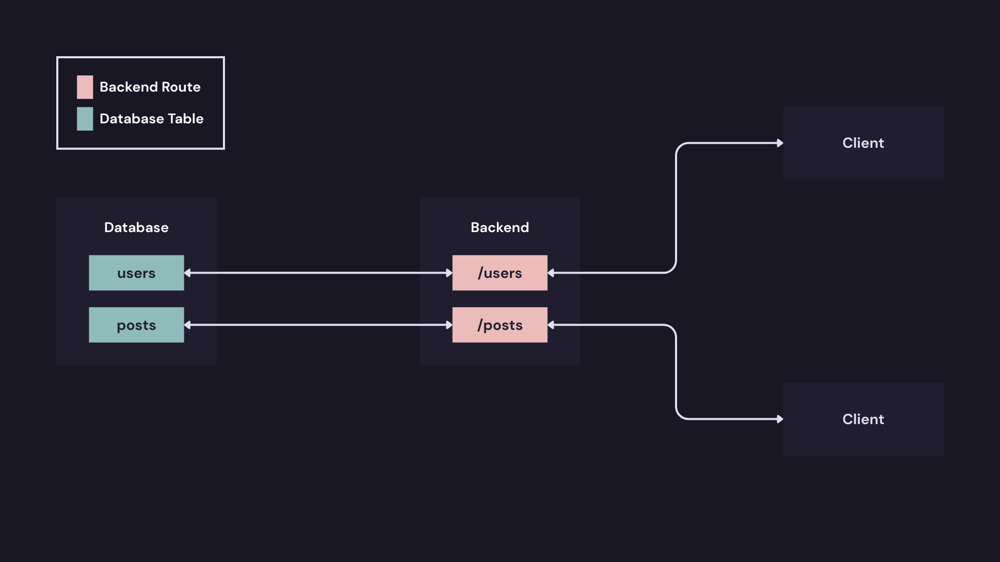

# Bab 2 : Gin Framework Fundamentals

## 2.1 Mengenal Gin

### 2.1.1 Apa itu Gin Framework

Dalam dunia pengembangan backend menggunakan Golang, Gin (atau sering disebut Gin-Gonic) adalah salah satu web framework yang paling populer dan banyak digunakan. Gin dikenal karena kecepatannya, kesederhanaannya, dan performanya yang tinggi.


Mengapa perlu framework? Bukankah Go sudah punya `net/http`?

Bayangkan `net/http` itu seperti membangun rumah dengan memotong kayu dan mencampur semen sendiri. Punya kontrol penuh, tapi butuh waktu lama dan rawan kesalahan untuk fitur dasar seperti routing kompleks atau middleware. Gin hadir seperti kontraktor yang membawa peralatan canggih dan modul siap pasang. Gin dibangun di atas `net/http`, tapi mempermudah hal-hal yang rumit sehingga pengembangan aplikasi menjadi jauh lebih cepat dan terstruktur.

### 2.1.2 Kenapa Memilih Gin?

Ada tiga alasan utama kenapa Gin menjadi pilihan de facto bagi banyak perusahaan dan developer Go :

- Performa Tinggi : Gin menggunakan `httprouter`, sebuah multiplexer HTTP kustom yang sangat cepat. Gin mengklaim dirinya 40x lebih cepat daripada framework sejenis lainnya (seperti Martini).
- Popularitas & Ekosistem : Karena sangat populer, mencari solusi saat stuck atau mencari library pendukung (seperti CORS, Gzip, Auth) sangat mudah. Dukungan komunitasnya masif.
- Kesederhanaan (Simplicity) : API yang ditawarkan Gin sangat intuitif. Menangani request JSON, validasi data, dan routing bisa dilakukan dengan kode yang sangat ringkas.

### 2.1.3 Perbandingan : Gin vs Echo vs Fiber vs `net/http`

Agar lebih yakin, mari lihat perbandingan singkatnya :

| Framework   | Kelebihan Utama                                                                                              | Kekurangan / Catatan                                                                                                 |
| :---------- | :----------------------------------------------------------------------------------------------------------- | :------------------------------------------------------------------------------------------------------------------- |
| **`net/http`**  | Standar bawaan Go. Stabil, tidak ada dependensi eksternal.                                                   | Kode menjadi sangat panjang (verbose) untuk fitur standar seperti dynamic routing atau middleware chains.            |
| **Gin**       | Keseimbangan sempurna antara performa, kemudahan, dan fitur. Ekosistem terbesar.                            | Sedikit lebih lambat dari Fiber (meski bedanya dalam nanodetik, jarang terasa di aplikasi bisnis umum).             |
| **Echo**      | Sangat mirip dengan Gin, dokumentasi sangat rapi.                                                            | Komunitasnya sedikit lebih kecil dibanding Gin, meski secara fitur sangat bersaing.                                  |
| **Fiber**     | Tercepat (berbasis `fasthttp`, bukan `net/http`). Sangat mirip Express.js.                                       | Tidak kompatibel 100% dengan `net/http`. Ini bisa menyulitkan jika ingin menggunakan library standar Go lain yang butuh kompatibilitas `net/http`. |

Untuk proyek backend profesional yang membutuhkan kestabilan, kompatibilitas luas, dan kemudahan maintenance, Gin adalah pilihan yang sangat aman dan solid.

### 2.1.4 Instalasi dan Setup Gin

Sebelum mulai, pastikan Go sudah terinstal di komputer. Langkah pertama dalam setiap proyek Go modern adalah inisialisasi modul.

Buka terminal dan jalankan perintah berikut untuk membuat folder proyek dan inisialisasi `go.mod` :

```bash
$ cd <folder>
$ go mod init <folder>
```

Setelah itu, unduh package Gin :

```bash
$ go get -u github.com/gin-gonic/gin
```

Perintah ini akan mengunduh Gin dan dependensinya, serta mencatatnya di file `go.mod` dan `go.sum`.

### 2.1.5 First Gin Application (Hello World)

Tujuan aplikasi pertama ini sederhana, yaitu membuat server HTTP yang merespons dengan format JSON ketika diakses.

Mengapa JSON? Karena dalam konteks Backend Developer, hampir 90% pekerjaan adalah membuat REST API yang berkomunikasi menggunakan JSON, bukan merender HTML.

Silakan buat file baru dan jalankan kode berikut :

2.1.5-1-SimpleServer.go

```go
package main

import (
	"net/http"

	"github.com/gin-gonic/gin"
)

func main() {
	// 1. Inisialisasi Router Gin
	// gin.Default() membuat instance router dengan middleware bawaan:
	// - Logger (mencatat log request ke console)
	// - Recovery (mencegah server crash/panic jika ada error fatal)
	r := gin.Default()

	// 2. Definisi Route
	// Ketika user akses GET ke root url "/", jalankan fungsi ini
	r.GET("/", func(c *gin.Context) {
		// c.JSON akan mengubah map/struct menjadi format JSON secara otomatis
		// dan mengatur Content-Type menjadi application/json
		c.JSON(http.StatusOK, gin.H{
			"message": "Hello! This is my first Gin Application",
			"status":  "success",
		})
	})

	// Route tambahan dengan parameter
	r.GET("/ping", func(c *gin.Context) {
		c.JSON(200, gin.H{
			"message": "pong",
		})
	})

	// 3. Menjalankan Server
	// Secara default akan berjalan di port 8080
	// Bisa diubah dengan r.Run(":3000")
	r.Run() 
}
```

Setelah kode disimpan, jalankan lewat terminal :

```bash
$ go run 2.1.5-1-SimpleServer.go
```

Output di terminal akan terlihat seperti ini (menandakan server aktif) :

```
[GIN-debug] Listening and serving HTTP on :8080
```

Sekarang, buka browser atau Postman dan akses http://localhost:8080. Hasilnya akan berupa JSON :

```json
{
  "message": "Hello! This is my first Gin Application",
  "status": "success"
}
```

Mari bedah bagian-bagian vital dari kode di atas :

- `gin.Default()` Ini adalah constructor standar. Gin sebenarnya punya `gin.New()` yang membuat router kosong tanpa middleware apa pun. Namun, `gin.Default()` sangat disarankan untuk pemula karena sudah menyertakan Logger (untuk melihat trafik di terminal) dan Recovery (agar satu bug fatal tidak mematikan seluruh server).
- `func(c *gin.Context)`: Ini adalah handler function. `*gin.Context`    adalah bagian paling penting di Gin. Objek c ini membawa semua informasi tentang :

    - Request (parameter URL, body JSON, header, cookies).
    - Response (cara mengirim balik data, validasi, kode status).
    - Menggantikan `http.ResponseWriter` dan `*http.Request` di `net/http` standar.

- `gin.H{}` : Ini hanyalah shortcut atau alias untuk `map[string]interface`{}. Daripada menulis tipe data yang panjang untuk membuat objek JSON sederhana, Gin menyediakan `gin.H` agar penulisan kode lebih rapi dan cepat.
- `r.Run()`: Metode ini memblokir eksekusi program dan mulai mendengarkan request HTTP. Jika tidak diberi parameter, ia akan menggunakan port `:8080` secara default.

Dengan pemahaman dasar ini, fondasi untuk membangun API yang lebih kompleks sudah terbentuk. Selanjutnya, materi akan membahas bagaimana cara menangani berbagai jenis request method dan memproses data yang dikirim oleh pengguna.

Untuk mencoba kodenya, silakan akses : [2.1.5-1-SimpleServer.go](2.1-SimpleServer.go)

## 2.2 Basic Routing di Gin (HTTP Methods)



Bayangkan sebuah gedung perkantoran besar dengan satu pintu masuk utama. Di lobi, ada seorang resepsionis yang sangat cekatan. Setiap tamu yang datang pasti ditanya: "Mau kemana?" dan "Apa tujuannya?".

- Jika tamu membawa paket surat, resepsionis mengarahkan ke Ruang Surat.
- Jika tamu ingin bertemu manajer, diarahkan ke Ruang Rapat.
- Jika tamu ingin mendaftar kerja, diarahkan ke HRD.

Dalam Gin, Routing adalah resepsionis tersebut. Ia bertugas memetakan permintaan (request) yang masuk ke URL tertentu menuju ke fungsi penangan (handler) yang tepat berdasarkan metode HTTP yang digunakan.

Tanpa routing yang jelas, aplikasi tidak akan tahu harus berbuat apa saat pengguna mengakses `/users` atau `/products`.

Dalam standar REST API, setiap aksi memiliki metode HTTP yang spesifik. Menggunakan metode yang tepat membuat API mudah dipahami oleh developer lain (semantik).

Berikut adalah pemetaan standar metode HTTP dan kegunaannya :

### 2.2.1 GET Method

GET adalah metode yang paling sering digunakan. Ketika client mengirim permintaan GET, server akan mencari data yang diminta dan mengembalikannya. 

Metode ini bersifat aman (safe) karena tidak boleh mengubah kondisi data di server. Baik data ditemukan maupun tidak, tidak boleh ada data yang berubah akibat metode ini.

Bisa dilihat di kode ini : 

2.2.1-1-GetMethod.go

```go
package main

import (
	"net/http"

	"github.com/gin-gonic/gin"
)

type Book struct {
	ID     int    `json:"id"`
	Title  string `json:"title"`
	Author string `json:"author"`
}

func main() {
	r := gin.Default()

	// 1. GET: Mengambil data
	r.GET("/books", func(c *gin.Context) {

		// Ambil data buku dari fungsi
		bookData := getBookData()

		c.JSON(http.StatusOK, gin.H{
			"message": "Showing list of books",
			"data":    bookData,
		})
	})

	r.Run(":8080")
}


// Fungsi simulasi mengambil data dari database
func getBookData() []Book {

	books := []Book{
		{ID: 1, Title: "Clean Code", Author: "Robert C. Martin"},
		{ID: 2, Title: "Refactoring", Author: "Martin Fowler"},
		{ID: 3, Title: "Domain-Driven Design", Author: "Eric Evans"},
	}

	return books
}
```

Penjelasan singkat bagian kode di atas seperti ini : 

- `type Book struct{}` : Agar data memiliki struktur yang jelas dan bisa dikonversi ke JSON.
- `gin.Default()` : Membuat instance router Gin yang sudah dilengkapi middleware bawaan seperti Logger (mencatat request ke terminal) dan Recovery (mencegah server crash jika terjadi panic)
- `r.GET("/books", handler)` : Mendaftarkan route dengan kelengkapan : 
	
	- Method : GET
	- Endpoint : `/books`
	- Handler : fungsi yang akan dijalankan saat endpoint diakses, 

	Jika ada request GET ke http://localhost:8080/books, maka fungsi di dalamnya akan dieksekusi.
- `c *gin.Context` : Objek Context digunakan untuk Mengambil parameter request, Mengakses body, Mengatur response. Di contoh ini, context digunakan untuk mengirim response JSON.
- `c.JSON(http.StatusOK, gin.H{...})` : Berguna untuk mengirim response informasi ke klien, jika kode di atas maka akan, berstatus code `200 OK` dengan Body berbentuk JSON. Dan sedangkan `gin.H` adalah shortcut untuk membuat map JSON.
- `r.Run(":8080")` : Menjalankan HTTP server pada port 8080. Tanpa baris ini, server tidak akan berjalan.
- `getBookData()` : Fungsi contoh asumsi dia mendapatkan data dari database.

> `getBookData()` merupakan fungsi asumsi untuk mendapatkan data dari database, fungsi ini fleksibel tergantuk developer, pemahaman ini ada di bab lain.

Dari kode di atas bisa dijalankan, akses di `curl` atau API tester : 

```bash
$ curl http://localhost:8080/books
```

Atau lebih eksplisit dengan metode GET :

```bash
$ curl -X GET http://localhost:8080/books
```

Maka server akan mengembalikan response :

```json
{
  "message": "Showing list of books",
  "data": [
    {
      "id": 1,
      "title": "Clean Code",
      "author": "Robert C. Martin"
    },
    {
      "id": 2,
      "title": "Refactoring",
      "author": "Martin Fowler"
    },
    {
      "id": 3,
      "title": "Domain-Driven Design",
      "author": "Eric Evans"
    }
  ]
}
```

Dengan status HTTP :

```
200 OK
```

Dari contoh di atas, dapat disimpulkan bahwa ketika client mengakses endpoint `/books` menggunakan metode GET, Gin akan menjalankan handler yang sesuai dan mengembalikan data dalam format JSON tanpa mengubah kondisi data di server.

Namun, jika di coba lagi dengan sembarang routing, misal `/unkown` :

```bash
$ curl http://localhost:8080/unknown
```

Maka response yang di dapat pada API tester :

```
404 page not found
```

Ini jelas, jika route tidak terdaftar, Gin akan mengembalikan 404 Not Found. Ini menunjukkan pentingnya mendefinisikan routing dengan benar.

Untuk mencoba kode di [2.2.1-1-GetMethod.go](../../codes/2/2.2.1/2.2.1-1-GetMethod.go)

### 2.2.2 POST Method

POST digunakan ketika client ingin menambahkan data baru ke server. Biasanya data dikirim melalui body request dalam format JSON. Berbeda dengan GET, metode POST tidak bersifat safe karena akan mengubah kondisi data di server (misalnya menambah entri baru di database).

Bisa dilihat di kode ini : 

2.2.2-1-PostMethod.go

```go
package main

import (
	"net/http"
	"github.com/gin-gonic/gin"
)

type Book struct {
	ID     int    `json:"id"`
	Title  string `json:"title"`
	Author string `json:"author"`
}

// Simulasi database (in-memory)
var books = []Book{
	{ID: 1, Title: "Clean Code", Author: "Robert C. Martin"},
	{ID: 2, Title: "Refactoring", Author: "Martin Fowler"},
}

func main() {
	r := gin.Default()

	// 2. POST: Menambahkan data baru
	r.POST("/books", func(c *gin.Context) {

		var newBook Book

		// Bind JSON dari body request
		if err := c.ShouldBindJSON(&newBook); err != nil {
			c.JSON(http.StatusBadRequest, gin.H{
				"error": "Invalid JSON data",
			})
			return
		}

		// Generate ID sederhana (auto increment)
		newBook.ID = len(books) + 1

		// Tambahkan ke slice (simulasi insert database)
		books = append(books, newBook)

		c.JSON(http.StatusCreated, gin.H{
			"message": "Book created successfully",
			"data":    newBook,
		})
	})

	r.Run(":8080")
}
```

Penjelasan singkat bagian kode di atas seperti ini :

- `var books = []Book{...}` : Berfungsi sebagai simulasi database sementara. Data disimpan dalam slice global.
- `r.POST("/books", handler)` : Mendaftarkan route dengan kelengkapan :
  
  - Method : POST
  - Endpoint : `/books`
  - Handler : fungsi yang akan dijalankan saat endpoint diakses

  Jika ada request POST ke http://localhost:8080/books, maka fungsi di dalamnya akan dieksekusi.

- `var book struct {...}` : Membuat struktur sementara untuk menampung data JSON yang dikirim client.
- `c.ShouldBindJSON(&book)` : Digunakan untuk membaca dan mengikat (bind) data JSON dari body request ke struct book. Jika format JSON tidak sesuai, maka akan mengembalikan error.
- `newBook.ID = len(books) + 1` : Karena belum pakai database, ID dibuat manual dengan auto increment sederhana.
- `books = append(books, newBook)` : Menambahkan data baru ke slice `books`. Ini mensimulasikan proses INSERT ke database.
- `http.StatusBadRequest (400)` : Digunakan jika JSON yang dikirim client tidak valid.
- `http.StatusCreated (201)` : Digunakan jika data berhasil dibuat.
Status ini adalah standar REST API untuk proses pembuatan resource baru.

> Note : Skenario `newBook.ID = len(books) + 1` khusus di kode ini, bagian ini dan pelengkapnya bisa di sesuaikan tergantun kode.

Dari kode di atas bisa dijalankan, akses di `curl` atau API tester : 

```bash
curl -X POST http://localhost:8080/books \
  -H "Content-Type: application/json" \
  -d '{"title":"Domain-Driven Design","author":"Eric Evans"}
```

Maka response jika berhasil yang dihasilkan adalah : 

```json
{
  "message": "Book created successfully",
  "data": {
    "id": 3,
    "title": "Domain-Driven Design",
    "author": "Eric Evans"
  }
}
```

Dengan status HTTP :

```
201 Created
```

Namun, jika body JSON tidak valid atau tidak dikirim :

```bash
$ curl -X POST http://localhost:8080/books
```

Maka response yang didapat :

```json
{
  "error": "Invalid JSON data"
}
```

Dengan status HTTP :

```
400 Bad Request
```

Dari contoh di atas, dapat disimpulkan bahwa ketika client mengakses endpoint `/books` menggunakan metode POST, Gin akan membaca data dari body request, memvalidasi format JSON, lalu mengembalikan response sesuai hasil proses tersebut.

Berbeda dengan GET, metode POST digunakan untuk membuat resource baru dan akan mengubah kondisi data di server.

Kode bisa di akses di [2.2.2-1-PostMethod.go](../../codes/2/2.2.2/2.2.2-1-PostMethod.go)

### 2.2.3 PUT Method

Jika client ingin memperbarui data yang sudah ada, mereka bisa menggunakan PUT. Sifatnya adalah idempotent, artinya permintaan yang sama jika dikirim berulang kali akan menghasilkan efek yang sama. Penting untuk dicatat bahwa PUT biasanya mengharapkan client mengirimkan data yang lengkap untuk menggantikan data lama secara utuh.

Berbeda dengan POST yang membuat data baru, PUT biasanya digunakan untuk mengganti seluruh data pada resource yang sudah ada.

Bisa dilihat di kode ini : 

2.2.3-1-PutMethod.go

```go
package main

import (
	"net/http"
	"strconv"

	"github.com/gin-gonic/gin"
)

type Book struct {
	ID     int    `json:"id"`
	Title  string `json:"title"`
	Author string `json:"author"`
}

// Simulasi database (in-memory)
var books = []Book{
	{ID: 1, Title: "Clean Code", Author: "Robert C. Martin"},
	{ID: 2, Title: "Refactoring", Author: "Martin Fowler"},
}

func main() {
	r := gin.Default()

	// 3. PUT: Mengganti seluruh data
	r.PUT("/books/:id", func(c *gin.Context) {

		idParam := c.Param("id")

		id, err := strconv.Atoi(idParam)
		if err != nil {
			c.JSON(http.StatusBadRequest, gin.H{
				"error": "Invalid book ID",
			})
			return
		}

		var updatedBook Book

		// Bind JSON dari body request
		if err := c.ShouldBindJSON(&updatedBook); err != nil {
			c.JSON(http.StatusBadRequest, gin.H{
				"error": "Invalid JSON data",
			})
			return
		}

		// Panggil fungsi update terpisah
		book, found := updateBookByID(id, updatedBook)

		if !found {
			c.JSON(http.StatusNotFound, gin.H{
				"error": "Book not found",
			})
			return
		}

		c.JSON(http.StatusOK, gin.H{
			"message": "Book updated successfully",
			"data":    book,
		})
	})

	r.Run(":8080")
}

// Fungsi Terpisah untuk Update Data
func updateBookByID(id int, updatedData Book) (Book, bool) {

	for i, book := range books {
		if book.ID == id {
			updatedData.ID = id // Pastikan ID tetap sama
			books[i] = updatedData
			return updatedData, true
		}
	}

	return Book{}, false
}

```

Penjelasan singkat bagian kode di atas seperti ini :

- `r.PUT("/books/:id", handler)` : Mendaftarkan route dengan kelengkapan :
  - Method : PUT
  - Endpoint : `/books/:id`, `:id` adalah route parameter
- Handler : fungsi yang akan dijalankan saat endpoint diakses, Jika ada request PUT ke http://localhost:8080/books/1, maka fungsi di dalamnya akan dieksekusi.
- `c.Param("id")` : Digunakan untuk mengambil nilai parameter id dari URL.
- `strconv.Atoi(idParam)` : Mengubah ID dari string menjadi integer karena parameter URL selalu berbentuk string.
- `c.ShouldBindJSON(&book)` : Membaca dan mengikat data JSON dari body request ke struct book. Jika format JSON tidak valid, maka akan mengembalikan error.
- `updateBookByID(id, updatedBook)` : Fungsi terpisah yang menangani logika update.

> Catatan : Fungsi `updateBookByID(id, updatedBook)` dinamis tergantung kegunaan kode.

Kita coba jalankan. Untuk menguji PUT, kirim body JSON lengkap karena PUT biasanya mengganti seluruh data.

```bash
$ curl -X PUT http://localhost:8080/books/1 \
  -H "Content-Type: application/json" \
  -d '{"title":"New Clean Code","author":"Robert Martin"}'
```

Maka response yang dihasilkan jika berhasil :

```json
{
  "message": "Book updated successfully",
  "data": {
    "id": 1,
    "title": "New Clean Code",
    "author": "Robert Martin"
  }
}
```

Dengan status HTTP :

```
200 OK
```

Namun, jika body JSON tidak valid :

```bash
$ curl -X PUT http://localhost:8080/books/1
```

Maka response yang didapat :

```json
{
  "error": "Invalid JSON data"
}
```

Dengan status HTTP :

```
400 Bad Request
```

Kita juga coba dengan ID yang tidak ada : 

```bash
$ curl -X PUT http://localhost:8080/books/99 \
  -H "Content-Type: application/json" \
  -d '{"title":"Test","author":"Test"}'
```

Maka hasilnya adalah : 

```json
{
  "error": "Book not found"
}
```

Dengan status : 

```
404 Not Found
```

Dari contoh di atas, dapat disimpulkan bahwa ketika client mengakses endpoint `/books/:id` menggunakan metode PUT, Gin akan membaca parameter dari URL, mengambil data dari body request, lalu mengganti data sesuai dengan informasi yang dikirim.

Karena PUT bersifat idempotent, pengiriman request yang sama berulang kali tidak akan mengubah hasil akhir dari resource tersebut.

Kode bisa di akses di [2.2.3-1-PutMethod.go](../../codes/2/2.2.3/2.2.3-1-PutMethod.go)

### 2.2.4 PATCH Method

Berbeda dengan PUT yang mengganti seluruh data, PATCH digunakan untuk modifikasi parsial. Client hanya perlu mengirimkan field atau kolom mana yang ingin diubah. Ini lebih efisien untuk pembaruan data yang tidak terlalu besar. PATCH umumnya tidak selalu idempotent, tergantung implementasinya.

Bisa dilihat di kode ini : 

2.2.4-1-PatchMethod.go

```go
package main

import (
	"net/http"
	"strconv"

	"github.com/gin-gonic/gin"
)

type Book struct {
	ID     int    `json:"id"`
	Title  string `json:"title"`
	Author string `json:"author"`
}

// Simulasi database (in-memory)
var books = []Book{
	{ID: 1, Title: "Clean Code", Author: "Robert C. Martin"},
	{ID: 2, Title: "Refactoring", Author: "Martin Fowler"},
}

// Struct khusus untuk PATCH (pakai pointer agar bisa deteksi field yang dikirim)
type UpdateBookInput struct {
	Title  *string `json:"title"`
	Author *string `json:"author"`
}

func main() {
	r := gin.Default()

	// 4. PATCH: Update sebagian data
	r.PATCH("/books/:id", func(c *gin.Context) {

		idParam := c.Param("id")

		id, err := strconv.Atoi(idParam)
		if err != nil {
			c.JSON(http.StatusBadRequest, gin.H{
				"error": "Invalid book ID",
			})
			return
		}

		var input UpdateBookInput

		// Bind JSON parsial
		if err := c.ShouldBindJSON(&input); err != nil {
			c.JSON(http.StatusBadRequest, gin.H{
				"error": "Invalid JSON data",
			})
			return
		}

		// Panggil fungsi update parsial terpisah
		book, found := patchBookByID(id, input)

		if !found {
			c.JSON(http.StatusNotFound, gin.H{
				"error": "Book not found",
			})
			return
		}

		c.JSON(http.StatusOK, gin.H{
			"message": "Book partially updated",
			"data":    book,
		})
	})

	r.Run(":8080")
}

// Fungsi Terpisah untuk PATCH
func patchBookByID(id int, input UpdateBookInput) (Book, bool) {

	for i, book := range books {

		if book.ID == id {

			// Update hanya field yang dikirim
			if input.Title != nil {
				books[i].Title = *input.Title
			}

			if input.Author != nil {
				books[i].Author = *input.Author
			}

			return books[i], true
		}
	}

	return Book{}, false
}

```

Penjelasan singkat bagian kode di atas seperti ini :

- `r.PATCH("/books/:id", handler)` : Mendaftarkan route dengan kelengkapan :
  
  - Method : PATCH
  - Endpoint : `/books/:id`, `:id` adalah route parameter
- `Struct UpdateBookInput`: struct khusus untuk inputan.
- Handler : fungsi yang akan dijalankan saat endpoint diakses. Jika ada request PATCH ke http://localhost:8080/books/1, maka fungsi di dalamnya akan dieksekusi.
- `c.Param("id")` : Digunakan untuk mengambil nilai parameter id dari URL.
- `Title *string` dan `Author *string` : Menggunakan pointer agar dapat membedakan antara :

  - Field yang tidak dikirim
  - Field yang dikirim tetapi bernilai kosong

  Ini penting dalam PATCH karena kita hanya ingin mengubah field yang benar-benar dikirim oleh client.

Karena PATCH bersifat parsial, kita cukup mengirim field yang ingin diubah. Contoh hanya mengubah title :

```bash
$ curl -X PATCH http://localhost:8080/books/1 \
  -H "Content-Type: application/json" \
  -d '{"title":"Clean Code 2nd Edition"}'
```

Jika berhasil, server akan mengembalikan:

```json
{
  "message": "Book partially updated",
  "data": {
    "id": 1,
    "title": "Clean Code 2nd Edition",
    "author": "Robert C. Martin"
  }
}
```

Dengan status HTTP :

```
200 OK
```

Namun, jika body JSON tidak valid:

```bash
$ curl -X PATCH http://localhost:8080/books/1
```

Maka response yang didapat :

```json
{
  "error": "Book not found"
}
```

Dengan status HTTP :

```
400 Bad Request
```
Coba juga dengan 

```bash
$ curl -X PATCH http://localhost:8080/books/67 \
  -H "Content-Type: application/json" \
  -d '{"title":"Clean Code 2nd Edition"}'
```

Maka responnya adalah : 

```json
{
  "error": "Book not found"
}
```

Dengan status HTTP :

```
404 Not Found
```


Dari contoh di atas, dapat disimpulkan bahwa ketika client mengakses endpoint `/books/:id` menggunakan metode PATCH, Gin akan membaca parameter dari URL dan hanya memperbarui field yang dikirim oleh client.

PATCH digunakan untuk update sebagian data dan lebih efisien dibandingkan PUT ketika perubahan tidak mencakup seluruh resource.

Bisa diakses kode di [2.2.4-1-PatchMethod](../../codes/2/2.2.4/2.2.4-1-PatchMethod.go)

### 2.2.5 DELETE Method

Sesuai namanya, metode ini digunakan untuk menghapus data yang ditentukan dari server. Sama seperti PUT, DELETE juga bersifat idempotent. Permintaan yang sama akan tetap menghasilkan data tersebut telah hilang (meskipun responsnya bisa berbeda, misalnya `200 OK` untuk penghapusan pertama dan `404 Not Found` untuk percobaan kedua). DELETE biasanya tidak memerlukan body request, cukup dengan menentukan resource melalui URL.

Bisa dilihat di kode ini : 

2.2.5-1-DeleteMethod.go

```go
package main

import (
	"net/http"
	"strconv"

	"github.com/gin-gonic/gin"
)

type Book struct {
	ID     int    `json:"id"`
	Title  string `json:"title"`
	Author string `json:"author"`
}

// Simulasi database (in-memory)
var books = []Book{
	{ID: 1, Title: "Clean Code", Author: "Robert C. Martin"},
	{ID: 2, Title: "Refactoring", Author: "Martin Fowler"},
}

func main() {
	r := gin.Default()

	// 5. DELETE: Menghapus data
	r.DELETE("/books/:id", func(c *gin.Context) {

		idParam := c.Param("id")

		id, err := strconv.Atoi(idParam)
		if err != nil {
			c.JSON(http.StatusBadRequest, gin.H{
				"error": "Invalid book ID",
			})
			return
		}

		// Panggil fungsi delete terpisah
		deletedBook, found := deleteBookByID(id)

		if !found {
			c.JSON(http.StatusNotFound, gin.H{
				"error": "Book not found",
			})
			return
		}

		c.JSON(http.StatusOK, gin.H{
			"message": "Book deleted successfully",
			"data":    deletedBook,
		})
	})

	r.Run(":8080")
}

// Fungsi untuk hapus
func deleteBookByID(id int) (Book, bool) {

	for i, book := range books {
		if book.ID == id {
			// Simpan data yang akan dihapus
			deletedBook := book

			// Hapus dari slice
			books = append(books[:i], books[i+1:]...)

			return deletedBook, true
		}
	}
	return Book{}, false
}
```

Penjelasan dari kode di atas :

- `r.DELETE("/books/:id", handler)` : Mendaftarkan route dengan kelengkapan :
   
   - Method : DELETE
   - Endpoint : `/books/:id`, `:id` adalah route parameter
   - Handler : fungsi yang akan dijalankan saat endpoint diakses
  
  Jika ada request DELETE ke http://localhost:8080/books/1, maka fungsi di dalamnya akan dieksekusi.

- Fungsi `deleteBookByID` : Untuk fungsi hapus data.

Uji test dengan `curl` atau API Tester : 

```bash
$ curl -X DELETE http://localhost:8080/books/1
```

Jika berhasil maka akan mengeluarkan informasi :

```json
{
  "message": "Book deleted successfully",
  "data": {
    "id": 1,
    "title": "Clean Code",
    "author": "Robert C. Martin"
  }
}
```

Status :

```
200 OK
```

Namun jika ID tidak ditemukan :

```json
{
  "error": "Book not found"
}
```

Dengan status : 

```
404 Not Found
```

Dari contoh di atas, dapat disimpulkan bahwa ketika client mengakses endpoint `/books/:id` menggunakan metode DELETE, Gin akan mengambil parameter dari URL dan menghapus resource yang dimaksud.

Karena DELETE bersifat idempotent, pengiriman request yang sama berulang kali tidak akan mengubah hasil akhir yaitu resource tersebut tetap dalam keadaan terhapus.

Kode bisa diakses di [2.2.5-1-DeleteMethod.go](../../codes/2/2.2.5/2.2.5-1-DeleteMethod.go)

## 2.3 Request Handling

Dalam pengembangan backend, salah satu tugas utama adalah menerima data dari klien (frontend, mobile app, atau layanan lain). Data ini bisa berupa JSON, form data, atau file upload.

Mengapa kita butuh mekanisme Request Handling khusus? Bayangkan jika harus memparsing teks JSON mentah (`{"name": "Budi", "age": 20}`) secara manual menjadi variabel Golang. Pasti melelahkan dan rentan error. Gin menyediakan fitur Binding yang bertindak sebagai penerjemah otomatis. Ia mengubah data mentah dari HTTP request langsung menjadi struktur data (Struct) Golang yang aman dan siap pakai.

### 2.3.1 Binding Data & Validasi (JSON, Form, Query)

Konsep dasarnya sederhana adalah seperti menyiapkan wadah (Struct) dengan label (Tag), lalu suruh Gin mengisinya.

#### 2.3.1.1 Struct Tags

Agar Gin tahu field mana yang harus diisi, gunakan tag pada struct.

##### 1. `json:"fieldname"` -> Untuk data dari Body (Raw JSON).
  
Contoh :
  
```go
type Product struct {
	Name string `json:"name"`
}
```

Request JSON : 

```json
{
  "name": "Laptop"
}
```

##### 2. `form:"fieldname"` -> Untuk data dari Form Data atau Query Param.

Contoh : 

```go
type Login struct {
	Username string `form:"username"`
	Password string `form:"password"`
}
```

Query : 

```
/login?username=hilmi&password=123
```

##### 3. `binding:"required"` -> Untuk validasi (wajib diisi).

Contoh : 

```go
Name string `json:"name" binding:"required"`
```

##### 4. `binding:"required,email"` -> Untuk multi validasi (wajib diisi, dan harus format email) 

Contoh : 

```go
Name string `json:"name" binding:"required"`
```

##### 5. `binding:"gte=18,lte=60` -> Untuk validasi angka (minimal 18, maksimal 60)

Contoh :

```go
Age int `json:"age" binding:"gte=18,lte=60"`
```

##### 6. `binding:"min=3,max=20"` -> Untuk validasi panjang string (minimal 3, maksimal 20)

Contoh : 

```go
Username string `json:"username" binding:"min=3,max=20"`
```

#### 2.3.1.2 ShouldBind vs MustBind 

Gin memiliki dua keluarga method untuk binding :

- Type Bind (MustBind) : Contohnya `c.BindJSON()`. Jika validasi gagal (misal field required kosong), Gin akan otomatis menghentikan request, mengirim status 400, dan menulis header response. Anda tidak bisa mengontrol format error-nya.
  
  Implementasi Kode : 

  ```go
  c.JSON(http.StatusOK, gin.H{"data": input})
  ```

- Type ShouldBind : Contohnya `c.ShouldBindJSON()`. Jika validasi gagal, ia akan mengembalikan error dan membiarkan programmer yang menentukan penanganan error tersebut (misalnya membungkusnya dalam format JSON standar API Anda).

  Implementasi Kode :

  ```go
  if err := c.ShouldBindJSON(&input); err != nil {
	c.JSON(http.StatusBadRequest, gin.H{"error": err.Error()})
	return
  }
  ```

> Rekomendasi : Selalu gunakan ShouldBind di production agar Anda punya kontrol penuh terhadap error handling.

#### 2.3.1.3 Contoh Kode

Saatnya buat contoh implementasi yang mencakup Binding JSON, Validasi, dan Query Param : 

2.3.1.3-1-BindingData.go

```go
package main

import (
	"net/http"

	"github.com/gin-gonic/gin"
)

// UserRegister mendefinisikan struktur data yang diharapkan dari client
type UserRegister struct {
	// binding:"required" memastikan field ini tidak boleh kosong
	Username string `json:"username" binding:"required"`
	
	// binding:"email" memvalidasi format email
	Email    string `json:"email" binding:"required,email"`
	
	// binding:"min=8" memastikan panjang minimal 8 karakter
	Password string `json:"password" binding:"required,min=8"`
	
	// Field optional, tidak perlu binding:"required"
	Age      int    `json:"age"` 
}

func main() {
	r := gin.Default()

	r.POST("/register", func(c *gin.Context) {
		var input UserRegister

		// 1. Lakukan Binding & Validasi
		// ShouldBindJSON akan membaca Body request dan mencocokkan dengan struct UserRegister
		if err := c.ShouldBindJSON(&input); err != nil {
			// Jika validasi gagal, kembalikan error 400 Bad Request
			// gin.H{"error": err.Error()} akan menampilkan detail error validasi
			c.JSON(http.StatusBadRequest, gin.H{"error": err.Error()})
			return
		}

		// 2. Simulasi Proses Data (misal simpan ke database)
		// Di sini input.Username dll sudah aman digunakan

		c.JSON(http.StatusOK, gin.H{
			"message":  "User berhasil didaftarkan",
			"username": input.Username,
			"email":    input.Email,
		})
	})

	// Contoh Binding Query String (misal: /search?q=golang&page=1)
	r.GET("/search", func(c *gin.Context) {
		var query struct {
			Q    string `form:"q" binding:"required"` // Gunakan tag 'form' untuk query param
			Page int    `form:"page"`
		}

		// ShouldBindQuery khusus untuk mengambil parameter dari URL
		if err := c.ShouldBindQuery(&query); err != nil {
			c.JSON(http.StatusBadRequest, gin.H{"error": err.Error()})
			return
		}

		c.JSON(http.StatusOK, gin.H{
			"search_query": query.Q,
			"page":         query.Page,
		})
	})

	r.Run(":8080")
}
```

Penjelasan singkat kode :

- `binding:"required,email"` : Gin menggunakan library `go-playground/validator` di belakang layar. Hal ini bisa menumpuk aturan validasi dengan tanda koma.
- `ShouldBindJSON(&input)` : Perhatikan tanda & (pointer). Kita harus mengirimkan alamat memori struct agar Gin bisa mengisi nilainya.

Sekarang coba codenya, dan uji coba dengan `curl` API tester :

```bash
$ curl -X POST http://localhost:8080/register \
-H "Content-Type: application/json" \
-d '{
	"username": "march",
	"email": "march@email.com",
	"password": "password123",
	"age": 21
}'
```

Maka response jika berhasil : 

```json
{
  "message": "User berhasil didaftarkan",
  "username": "march",
  "email": "march@email.com"
}
```

Namun misal dengan contoh email salah (atau tidak sesuai format) :

```bash
$ curl -X POST http://localhost:8080/register \
-H "Content-Type: application/json" \
-d '{
	"username": "hilmi",
	"email": "salahformat",
	"password": "password123"
}'
```

Maka mendapatkan response :

```
{
  "error": "Key: 'UserRegister.Email' Error:Field validation for 'Email' failed on the 'email' tag"
}
```

Hal ini karena bagian `email` sudah di format dengan khusus yaitu `email` sehingga wajib berformat email (user@domain).

Code bisa di pakai di [2.3.1.3-1-BindingData.go](../../codes/2/2.3.1.3/2.3.1.3-1-BindingData.go)

### 2.3.2 File Upload (Multipart/Form-Data)

Mengapa file upload berbeda? Karena file (gambar, pdf, video) adalah data biner, bukan teks. HTTP menanganinya dengan `Content-Type: multipart/form-data`. Gin sudah membungkus kerumitan parsing multipart ini menjadi sangat sederhana.

Ada dua skenario umum yaitu, upload satu file dan upload banyak file sekaligus.

2.3.2-1-FileUpload.go

```go
package main

import (
	"fmt"
	"net/http"
	"path/filepath"

	"github.com/gin-gonic/gin"
)

func main() {
	// Set batas memori untuk multipart form (default 32 MiB)
	r := gin.Default()
	r.MaxMultipartMemory = 8 << 20 // 8 MiB

	// 1. Single File Upload
	r.POST("/upload/single", func(c *gin.Context) {
		// Mengambil file dari form field bernama "file"
		file, err := c.FormFile("avatar")
		if err != nil {
			c.JSON(http.StatusBadRequest, gin.H{"error": "File avatar wajib diupload"})
			return
		}

		// Mendapatkan nama file asli
		filename := filepath.Base(file.Filename)
		
		// Menentukan lokasi simpan (pastikan folder 'uploads' sudah ada atau gunakan os.Mkdir)
		// Disini kita simpan di root project untuk penyederhanaan
		dst := "./" + filename

		// Menyimpan file ke server
		if err := c.SaveUploadedFile(file, dst); err != nil {
			c.JSON(http.StatusInternalServerError, gin.H{"error": "Gagal menyimpan file"})
			return
		}

		c.JSON(http.StatusOK, gin.H{
			"message":  "File berhasil diupload",
			"filename": filename,
			"size":     file.Size,
		})
	})

	// 2. Multiple File Upload
	r.POST("/upload/multiple", func(c *gin.Context) {
		// Parse form data terlebih dahulu untuk multipart
		form, err := c.MultipartForm()
		if err != nil {
			c.JSON(http.StatusBadRequest, gin.H{"error": "Gagal membaca form"})
			return
		}

		// Mengambil list file dari field "photos"
		files := form.File["photos"]

		for _, file := range files {
			filename := filepath.Base(file.Filename)
			
			// Simpan setiap file
			if err := c.SaveUploadedFile(file, "./"+filename); err != nil {
				c.JSON(http.StatusInternalServerError, gin.H{"error": fmt.Sprintf("Gagal upload %s", filename)})
				return
			}
		}

		c.JSON(http.StatusOK, gin.H{
			"message": fmt.Sprintf("%d file berhasil diupload", len(files)),
		})
	})

	r.Run(":8080")
}
```

Penjelasan singkat kode :

- `c.FormFile("avatar")` : Mengambil header file tunggal. Belum membaca seluruh konten file ke memori, sehingga hemat resource.
- `c.SaveUploadedFile(file, dst)` : Helper function dari Gin untuk memindahkan file dari buffer sementara ke lokasi tujuan di disk server.
- `c.MultipartForm()` : Digunakan saat perlu mengakses banyak file sekaligus.

Oke, sekarang saatnya mencoba, mulai dari single upload :

```bash
$ curl -X POST http://localhost:8080/upload/single \
  -F "avatar=@/path/to/your/image.jpg"
```

Jika berhasil, maka akan keluar response :

```json
{
  "message": "File berhasil diupload",
  "filename": "image.jpg",
  "size": 123456
}
```

Namun jika kita tidak menggisi filenya, maka response pun akan memberi kejelasan error sesuai yang ada di code :

```bash
$ curl -X POST http://localhost:8080/upload/single
```

Dan response gagal nya :

```json
{
  "error": "File avatar wajib diupload"
}
```

Juga, jika memaksa dengan tag yang salah :

```bash
$ curl -X POST http://localhost:8080/upload/single \
  -F "photo=@image.jpg"
```

Maka akan mendapat error juga, karena tidak match tagnya.

Kita coba untuk yang multi uploads :

```bash
$ curl -X POST http://localhost:8080/upload/multiple \
  -F "photos=@/path/to/photo1.jpg" \
  -F "photos=@/path/to/photo2.png"
```

Dan jika proses berhasil maka mendapat informasi :

```json
{
  "message": "2 file berhasil diupload"
}
```

Namun hal ini akan sama jika kita upload cuman satu file : 

```bash
$ curl -X POST http://localhost:8080/upload/multiple \
  -F "photos=@/path/to/single.jpg"
```

Hasil : 

```json
{
  "message": "1 file berhasil diupload"
}
```

Misal kita coba lagi, kalau filenya itu ga ada :

```bash
$ curl -X POST http://localhost:8080/upload/multiple \
  -F "photos=@/path/ke/file/tidakada.jpg"
```

Maka responsenya :

```
curl: (26) Failed to open/read local file from /path/ke/file/tidakada.jpg
```

Kita coba contoh dengan file yang berbeda format : 

```bash
$ curl -X POST http://localhost:8080/upload/single \
  -F "avatar=@/path/to/document.pdf"
```

Maka response : 

```json
{
  "message": "File berhasil diupload",
  "filename": "document.pdf",
  "size": 56789
}
```

Kita uji juga upload file ukuran besar (Melebihi 8MB) :

```bash
$ curl -X POST http://localhost:8080/upload/single \
  -F "avatar=@/path/to/largefile.mp4"
```

Maka response gagal :

```json
{
  "error": "http: request body too large"
}
```

Kode bisa di coba di [2.3.2-1-FileUpload.go](../../codes/2/2.3.2/2.3.2-1-FileUpload.go)

### 2.3.3 Custom Binding & Validation Tags (Best Practice)

Meskipun required dan email sudah cukup untuk banyak kasus, terkadang butuh validasi bisnis yang spesifik. Misalnya : "Umur harus di atas 17 tahun" atau "Kode pos harus 5 digit".

Alih-alih menulis `if input.Age < 17 di dalam handler` (yang membuat kode kotor), gunakan tag validasi.

Contoh struct yang baik untuk validasi kompleks :

```go
type UserProfile struct {
    // Validasi enum (hanya boleh "male" atau "female")
    Gender string `json:"gender" binding:"required,oneof=male female"`
    
    // Validasi panjang string tertentu
    PostalCode string `json:"postal_code" binding:"len=5,numeric"`
    
    // Validasi cross-field (PasswordConfirm harus sama dengan Password)
    Password        string `json:"password" binding:"required"`
    PasswordConfirm string `json:"password_confirm" binding:"eqfield=Password"`
}
```

Best Practices dalam Request Handling :

- Jangan Gunakan `map[string]interface{}` : Hindari binding ke map kecuali terpaksa (misal struktur JSON benar-benar dinamis). Selalu gunakan Struct agar tipe data terjaga (Type Safety).
- Pisahkan Struct Request : Buat struct khusus untuk request (seperti `UserRegisterRequest`) yang terpisah dari struct Database Model (User). Ini mencegah user jahat mengirim field yang tidak seharusnya diubah (seperti `is_admin` atau `wallet_balance`) -> ini dikenal sebagai Mass Assignment Vulnerability.
- Gunakan Pesan Error yang Jelas: Saat ShouldBind gagal, error bawaannya agak teknis. Untuk production, parsing error tersebut menjadi pesan yang ramah pengguna ("Password minimal 8 karakter", bukan "Field validation for 'Password' failed on the 'min' tag").

## 2.4 Response Handling

Setelah belajar cara menerima pesanan (Request), sekarang saatnya belajar cara menyajikan hidangan (Response).

Bayangkan di restoran. Jika memesan Steak, tapi pelayan melemparkannya begitu saja ke meja tanpa piring, tanpa garpu, dan tanpa saus, pengalaman Anda pasti buruk. Begitu juga dengan API.

Response Handling adalah seni mengemas data hasil pemrosesan server menjadi format yang rapi, standar, dan mudah dikonsumsi oleh klien (frontend, mobile app, atau sistem lain). Gin menyediakan cara yang sangat elegan untuk melakukan ini.

### 2.4.1 JSON Response (`gin.H` vs Struct)

JSON (JavaScript Object Notation) adalah standar industri saat ini. Di Gin, respons JSON dikirim menggunakan :

```go
c.JSON(statusCode, data)
```

Di Gin, ada dua cara utama membuat respons JSON :

- Menggunakan `gin.H` : Cepat, dinamis, cocok untuk prototyping atau respons sederhana. `gin.H` hanyalah alias untuk `map[string]interface{}`.

  Contoh : 

  ```go
  c.JSON(http.StatusOK, gin.H{
    "success": true,
    "message": "User retrieved successfully",
    "data": user,
  })
  ```

  - Kelebihan : Cepat, Fleksibel, Cocok untuk prototyping, Tidak perlu membuat struct tambahan
  - Kekurangan : Tidak type-safe, Rentan typo, Tidak terdokumentasi dengan baik, Tidak cocok untuk proyek besar. Misalnya typo :
  
    ```json
	"messgae": "Success" // compiler tidak akan error
	```

    Compiler tidak akan error. Frontend bisa rusak tanpa backend menyadarinya.

- Menggunakan Struct : Lebih ketat, aman (type-safe), dan terdokumentasi. Sangat disarankan untuk kode produksi (production-ready).
  
  Contoh : 

  ```go
  type UserResponse struct {
    ID    int    `json:"id"`
    Name  string `json:"name"`
    Email string `json:"email"`
  }

  func GetUser(c *gin.Context) {
    user := UserResponse{
        ID:    1,
        Name:  "Hilmi",
        Email: "hilmi@mail.com",
    }

    c.JSON(http.StatusOK, user)
  }
  ```

Mengapa Struct Lebih Baik? Type-safe, Self-documented, Konsisten, Mudah diintegrasikan dengan Swagger/OpenAPI, Aman dari typo, Jika field tidak ada, compiler akan memberi peringatan saat digunakan di kode.

### 2.4.2 Format Lain (XML, YAML, ProtoBuf)

Meskipun JSON raja, terkadang kita butuh format lain :

#### 2.4.2.1 XML

Biasanya untuk integrasi dengan sistem legacy (SOAP) atau perbankan. Contoh XML :

```xml
<?xml version="1.0" encoding="UTF-8"?>
<note>
  <to>Caelus</to>
  <from>March</from>
  <heading>Reminder</heading>
  <body>Don't forget me this weekend!</body>
</note>
```

Untuk inisialisasinya :

```go
c.XML(http.StatusOK, data)
```

Dan untuk XML struct :

```go
type Note struct {
    To      string `xml:"to"`
    From    string `xml:"from"`
    Heading string `xml:"heading"`
    Body    string `xml:"body"`
}
```

#### 2.4.2.2 YAML

Sering digunakan jika output API akan dikonsumsi sebagai konfigurasi. Contoh YAML :
 
```yaml
# Basic YAML example
user:
  name: John Doe
  id: 12345
  isActive: true
  roles:
    - admin
    - developer
  settings:
    theme: dark
```

Untuk insialisasinya : 

```
c.YAML(http.StatusOK, data)
```

Dan untuk YAML struct :

```go
type User struct {
	Name     string   `yaml:"name"`
	ID       int      `yaml:"id"`
	IsActive bool     `yaml:"isActive"`
	Roles    []string `yaml:"roles"`
	Settings struct {
		Theme string `yaml:"theme"`
	} `yaml:"settings"`
}
```

#### 2.4.2.3 ProtoBuf

Digunakan untuk komunikasi antar microservices yang butuh performa sangat tinggi (ukuran data jauh lebih kecil dari JSON). Contoh protobuf :

```proto
syntax = "proto3"; // Menentukan versi sintaks

message User {
  int32 id = 1;      // Tag unik '1' digunakan untuk identifikasi biner
  string name = 2;   // Tag unik '2'
  string email = 3;
}

message UserList {
  repeated User users = 1; // 'repeated' berfungsi seperti array/list
}
```

Untuk inisialisasinya : 

```go
c.ProtoBuf(http.StatusOK, data)
```

Untuk menggunakan ProtoBuf di Go, perlu install package :
- `google.golang.org/protobuf/proto`
- `google.golang.org/protobuf/reflect/protoreflect`

```go
import (
	"google.golang.org/protobuf/proto"
)

// Struct Go yang akan di-encode ke ProtoBuf
type UserProto struct {
	state         protoimpl.MessageState
	sizeCache     protoimpl.SizeCache
	unknownFields protoimpl.UnknownFields

	Id    int32  `protobuf:"varint,1,opt,name=id,proto3" json:"id,omitempty"`
	Name  string `protobuf:"bytes,2,opt,name=name,proto3" json:"name,omitempty"`
	Email string `protobuf:"bytes,3,opt,name=email,proto3" json:"email,omitempty"`
}

// Contoh penggunaan di Gin
func GetUserProtobuf(c *gin.Context) {
	user := &UserProto{
		Id:    1,
		Name:  "Hilmi",
		Email: "hilmi@mail.com",
	}
	
	c.ProtoBuf(http.StatusOK, user)
}
```

ProtoBuf jauh lebih efisien dibanding JSON dalam ukuran dan performa serialisasi. Sering digunakan  untuk : Microservices communication, High performance system, Payload kecil, gRPC environment.

### 2.4.3 Custom Response Headers

Sebelumnya kita sudah tau bahwa setiap transaksi bisa diberi Header dalam paket komunikasi. Header HTTP bukan cuma pajangan. Header membawa metadata penting. Contoh penggunaan :

- `Authorization` : Untuk mengirim token autentikasi (misal JWT).
  
  ```go
  c.Header("Authorization", "Bearer " + token)
  ```

- `X-Request-ID` : Untuk melacak jejak request (tracing).

  ```go
  c.Header("X-Request-ID", "req-abc123")
  ```

- `X-Total-Count` : Untuk memberitahu total data saat melakukan pagination.

  ```go
  c.Header("X-Total-Count", strconv.Itoa(totalRecords))
  ```

- `Content-Disposition` : Untuk memaksa browser mendownload file.

  ```go
  c.Header("Content-Disposition", "attachment; filename=report.pdf")
  ```

Contoh kode lengkap penggunaan custom header :

2.4.3-1-CustomHeader.go

```go
package main

import (
	"net/http"
	"github.com/gin-gonic/gin"
)

func main() {
	r := gin.Default()

	// Endpoint dengan custom header Authorization
	r.GET("/protected", func(c *gin.Context) {
		
		// Mengambil header Authorization dari request
		authToken := c.GetHeader("Authorization")
		
		// Validasi token sederhana (di production gunakan JWT)
		expectedToken := "Bearer secret123"
		
		if authToken != expectedToken {
			c.JSON(http.StatusUnauthorized, gin.H{
				"error": "Unauthorized: Invalid token",
			})
			return
		}

		// Set custom response header
		c.Header("X-Request-ID", "req-12345")
		c.Header("X-Api-Version", "v1.0")
		
		c.JSON(http.StatusOK, gin.H{
			"message": "Access granted",
			"data": gin.H{
				"user": "Hilmi",
				"role": "admin",
			},
		})
	})

	r.Run(":8080")
}
```

Penjelasan singkat :

- `c.GetHeader("Authorization")` : Mengambil nilai header Authorization dari request
- `c.Header()` digunakan untuk menambahkan custom header pada response

Untuk mencobanya, kita akan mulai dengan tanpa authorization header (akan gagal) :

```bash
$ curl http://localhost:8080/protected
```

Maka response :

```json
{
	"error":"Unauthorized: Invalid token"
}
```

Kita coba juga dengan authorization header yang benar : 

```bash
$ curl -H "Authorization: Bearer secret123" http://localhost:8080/protected
```

Dan akan mendapat response seharusnya :

```json
{
   "message": "Access granted",
   "data": {
     "user": "Hilmi",
     "role": "admin"
   }
}
```

Pada case kode ini, setiap transaksi yang tidak memiliki authorization header tidak akan di layani, yang dimana penggunaan custom header ini berfungsi untuk mengamankan layanan, agar tidak sembarang di pakai oleh sembarang orang jika bocor.

Untuk akses kode bisa cek di [2.4.3-1-CustomHeader.go](../../codes/2/2.4.3/2.4.3-1-CustomHeader.go)

### 2.4.4 HTTP Status Codes Best Practices

Salah satu kesalahan pemula adalah mengembalikan status `200 OK` padahal terjadi error, lalu menulis pesan error di body JSON. Ini buruk karena membingungkan monitoring tools dan klien.

Gunakan kode status sesuai semantiknya :

| Status Code               | Kapan Digunakan                |
| ------------------------- | ------------------------------ |
| 200 OK                    | GET sukses                     |
| 201 Created               | POST berhasil membuat resource |
| 204 No Content            | DELETE sukses tanpa body       |
| 400 Bad Request           | Validasi gagal                 |
| 401 Unauthorized          | Belum login                    |
| 403 Forbidden             | Tidak punya akses              |
| 404 Not Found             | Resource tidak ada             |
| 409 Conflict              | Data conflict                  |
| 422 Unprocessable Entity  | Validasi semantik gagal        |
| 500 Internal Server Error | Error server                   |

Contoh fleksibelnya :

```go
c.JSON(http.StatusCreated, newUser)
```

Sehingga bisa mengeluarkan status HTTP :

```
201 Created
```

### 2.4.5 Error Response Standardization

Masalah umum dalam tim yaitu Backend Developer A mengembalikan error formatnya `{"err": "message"}`, Developer B formatnya `{"error_code": 123, "msg": "..."}`. Frontend Developer pusing. Namun ada solusinya, yaitu membuat format baku untuk respons sukses dan gagal.

Contoh implementasi helper sederhana untuk standarisasi :

2.4.5-1-StandardResponse.go

```go
package main

import (
	"net/http"
	"github.com/gin-gonic/gin"
)

// Response adalah wrapper standar untuk semua output API
type Response struct {
	Success bool        `json:"success"`
	Message string      `json:"message"`
	Data    interface{} `json:"data,omitempty"` // omitempty: sembunyikan field jika nil
}

// ErrorResponse adalah struktur khusus untuk error yang lebih detail
type ErrorResponse struct {
	Success   bool        `json:"success"`
	Message   string      `json:"message"`
	ErrorCode string      `json:"error_code,omitempty"`
	Details   interface{} `json:"details,omitempty"`
}

// Helper function untuk respon sukses
func SendSuccess(c *gin.Context, message string, data interface{}) {
	c.JSON(http.StatusOK, Response{
		Success: true,
		Message: message,
		Data:    data,
	})
}

// Helper function untuk respon error sederhana
func SendError(c *gin.Context, status int, msg string) {
	c.JSON(status, Response{
		Success: false,
		Message: msg,
		Data:    nil, // Data kosong saat error
	})
}

// Helper function untuk respon error dengan detail
func SendDetailedError(c *gin.Context, status int, msg string, errorCode string, details interface{}) {
	c.JSON(status, ErrorResponse{
		Success:   false,
		Message:   msg,
		ErrorCode: errorCode,
		Details:   details,
	})
}

// Contoh data user
type User struct {
	ID    int    `json:"id"`
	Name  string `json:"name"`
	Email string `json:"email"`
}

func main() {
	r := gin.Default()

	// Endpoint sukses dengan data
	r.GET("/users/:id", func(c *gin.Context) {
		// Simulasi pengambilan data user
		user := User{
			ID:    1,
			Name:  "Hilmi",
			Email: "hilmi@mail.com",
		}

		// Gunakan helper SendSuccess
		SendSuccess(c, "User retrieved successfully", user)
	})

	// Endpoint error sederhana
	r.GET("/users/:id/posts", func(c *gin.Context) {
		// Simulasi resource tidak ditemukan
		SendError(c, http.StatusNotFound, "Posts not found for this user")
	})

	// Endpoint error dengan detail
	r.POST("/register", func(c *gin.Context) {
		// Simulasi validasi gagal
		validationErrors := map[string]string{
			"email":    "Email format invalid",
			"password": "Password must be at least 8 characters",
		}

		SendDetailedError(
			c,
			http.StatusBadRequest,
			"Validation failed",
			"VALIDATION_ERROR",
			validationErrors,
		)
	})

	// Endpoint sukses tanpa data
	r.DELETE("/users/:id", func(c *gin.Context) {
		c.JSON(http.StatusOK, Response{
			Success: true,
			Message: "User deleted successfully",
			Data:    nil,
		})
	})

	r.Run(":8080")
}
```

Penjelasan singkat kode :

- `Response struct` : Format standar untuk respons API dengan tiga field utama: `success` (boolean), `message` (string), dan `data` (interface{}).
- `ErrorResponse struct` : Format khusus untuk error yang membutuhkan informasi lebih detail seperti `error_code` dan `details`.
- `SendSuccess()` : Helper function untuk mengirim respons sukses dengan parameter yang fleksibel.
- `SendError()` : Helper function untuk mengirim respons error sederhana.
- `SendDetailedError()` : Helper function untuk mengirim respons error dengan detail tambahan seperti kode error dan informasi validasi.
- `omitempty` tag : Membuat field JSON tidak muncul jika nilainya kosong/nil.

Sekarang mari kita test endpoint-endpoint tersebut.

Test endpoint sukses dengan data :

```bash
$ curl http://localhost:8080/users/1
```

Response :

```json
{
  "success": true,
  "message": "User retrieved successfully",
  "data": {
	"id": 1,
	"name": "Hilmi",
	"email": "hilmi@mail.com"
  }
}
```

Test endpoint error sederhana :

```bash
$ curl http://localhost:8080/users/1/posts
```

Response :

```json
{
  "success": false,
  "message": "Posts not found for this user"
}
```

Test endpoint error dengan detail :

```bash
$ curl -X POST http://localhost:8080/register
```

Response :

```json
{
  "success": false,
  "message": "Validation failed",
  "error_code": "VALIDATION_ERROR",
  "details": {
	"email": "Email format invalid",
	"password": "Password must be at least 8 characters"
  }
}
```

Test endpoint sukses tanpa data :

```bash
$ curl -X DELETE http://localhost:8080/users/1
```

Response :

```json
{
  "success": true,
  "message": "User deleted successfully"
}
```

Dengan pembungkus (wrapper) seperti ini, frontend developer selalu tahu bahwa setiap respons pasti punya field `success`, `message`, dan `data`. Prediktabilitas adalah kunci API yang baik.

Keuntungan menggunakan standarisasi respons :

- **Konsistensi** : Semua endpoint menggunakan format yang sama
- **Mudah di-parse** : Frontend tidak perlu menebak-nebak struktur respons
- **Self-documenting** : Field `success` langsung memberitahu status operasi
- **Error handling yang jelas** : Membedakan antara error sederhana dan error yang butuh detail
- **Maintainability** : Jika perlu mengubah format respons, cukup ubah di satu tempat (helper function)

Best Practices untuk Response Standardization :

1. **Selalu gunakan helper function** : Jangan menulis struktur respons manual di setiap handler
2. **Konsisten dengan status code** : Jangan mengirim `200 OK` untuk error
3. **Berikan pesan yang jelas** : Pesan error harus membantu developer memahami masalah
4. **Gunakan error code** : Untuk error yang kompleks, berikan kode error yang dapat di-reference
5. **Dokumentasikan format respons** : Pastikan tim frontend tahu struktur yang digunakan

Kode dapat diakses di [2.4.5-1-StandardResponse.go](../../codes/2/2.4.5/2.4.5-1-StandardResponse.go)

## 2.5 Middleware di Gin

### 2.5.1 Apa itu Middleware?

Bayangkan sedang berjalan melewati keamanan bandara. Sebelum bisa masuk ke pesawat (Handler utama), harus melewati beberapa lapisan pemeriksaan :

- Pemeriksaan tiket (Validasi).
- Pindai barang bawaan (Security).
- Cap paspor (Logging).

Jika di salah satu pos ini ada masalah (misal tiket tidak valid), langsung disuruh pulang (Abort), tidak bisa lanjut ke pesawat. Namun, jika semua lancar, bisa masuk pesawat, terbang, dan mendarat.

Dalam Gin, Middleware adalah pos-pos pemeriksaan tersebut. Ia adalah blok kode yang dieksekusi di tengah-tengah antara saat request masuk dan sebelum response dikirim.

### 2.5.2 Mengapa Middleware Penting?

Tanpa middleware, Anda harus menulis kode validasi, logging, atau penanganan error di setiap fungsi handler. Itu akan membuat kode sangat berantakan dan sulit dikelola (DRY - Don't Repeat Yourself violation).

Middleware memungkinkan kita memisahkan logika lintas-kepentingan (cross-cutting concerns) seperti :

- `Logging` : Mencatat setiap request yang masuk.
- `Authentication` : Memastikan user sudah login.
- `CORS` : Mengizinkan akses dari domain lain.
- `Crash Recovery` : Mencegah server mati total jika ada error fatal.

### 2.5.3 Cara Kerja Middleware (The Onion Model)

Middleware di Gin bekerja seperti lapisan bawang.

1. Request masuk menembus lapisan terluar (Global Middleware).
2. Lalu menembus lapisan tengah (Group Middleware).
3. Sampai ke inti (Final Handler).
4. Setelah handler selesai, alur kembali keluar melewati lapisan-lapisan tadi (Post-processing).

Dua fungsi kunci dalam middleware Gin :

- `c.Next()`: Perintah untuk "Lanjut ke middleware/handler berikutnya". Kode setelah baris ini akan dijalankan saat perjalanan pulang (setelah handler utama selesai).
- `c.Abort()`: Perintah untuk "Berhenti di sini". Middleware berikutnya atau handler utama tidak akan dieksekusi.

### 2.5.4 Implementasi Lengkap

Mari kita implementasikan berbagai jenis middleware untuk memahami cara kerjanya secara praktis.

#### 2.5.4.1 Global Middleware (Diterapkan ke Semua Route)

Global middleware akan dijalankan untuk setiap request yang masuk, tanpa terkecuali. Ini cocok untuk logging, recovery, atau CORS.

2.5.4.1-1-GlobalMiddleware.go

```go
package main

import (
	"fmt"
	"net/http"
	"time"

	"github.com/gin-gonic/gin"
)

// Middleware untuk logging setiap request
func LoggerMiddleware() gin.HandlerFunc {
	return func(c *gin.Context) {
		// Catat waktu mulai request
		startTime := time.Now()

		// Catat informasi request
		method := c.Request.Method
		path := c.Request.URL.Path

		fmt.Printf("[%s] Request: %s %s\n", 
			startTime.Format("2006-01-02 15:04:05"), 
			method, 
			path,
		)

		// Lanjutkan ke middleware/handler berikutnya
		c.Next()
		
		// Kode di bawah ini dijalankan SETELAH handler selesai
		// Hitung durasi pemrosesan
		duration := time.Since(startTime)
		statusCode := c.Writer.Status()

		fmt.Printf("[%s] Response: %s %s - Status: %d - Duration: %v\n",
			time.Now().Format("2006-01-02 15:04:05"),
			method,
			path,
			statusCode,
			duration,
		)
	}
}

// Middleware untuk recovery dari panic
func RecoveryMiddleware() gin.HandlerFunc {
	return func(c *gin.Context) {
		defer func() {
			if err := recover(); err != nil {
				fmt.Printf("PANIC RECOVERED: %v\n", err)
				c.JSON(http.StatusInternalServerError, gin.H{
					"error": "Internal server error",
				})
			}
		}()

		c.Next()
	}
}

func main() {
	// Gunakan gin.New() untuk router kosong tanpa middleware bawaan
	r := gin.New()

	// Daftarkan global middleware
	// Urutan penting: middleware akan dieksekusi sesuai urutan pendaftaran
	r.Use(RecoveryMiddleware())
	r.Use(LoggerMiddleware())

	// Route biasa
	r.GET("/users", func(c *gin.Context) {
		c.JSON(http.StatusOK, gin.H{
			"message": "List of users",
			"data": []string{"Alice", "Bob", "Charlie"},
		})
	})

	// Route yang akan panic (untuk test recovery)
	r.GET("/panic", func(c *gin.Context) {
		panic("Something went wrong!")
	})

	r.Run(":8080")
}
```

Penjelasan singkat kode :

- `gin.New()` : Membuat router kosong tanpa middleware bawaan. Berbeda dengan `gin.Default()` yang sudah include Logger dan Recovery.
- `r.Use()` : Mendaftarkan middleware secara global (berlaku untuk semua route).
- `c.Next()` : Memanggil middleware atau handler berikutnya dalam chain.
- `defer func() { recover() }` : Pattern Go untuk menangkap panic dan mencegah crash.
- `time.Since()` : Menghitung durasi eksekusi request.

Mari kita test endpoint yang normal :

```bash
$ curl http://localhost:8080/users
```

Output di terminal server :

```
[2024-01-15 10:30:45] Request: GET /users
[2024-01-15 10:30:45] Response: GET /users - Status: 200 - Duration: 1.234ms
```

Response client :

```json
{
  "message": "List of users",
  "data": ["Alice", "Bob", "Charlie"]
}
```

Sekarang test endpoint yang panic :

```bash
$ curl http://localhost:8080/panic
```

Output di terminal server :

```
[2024-01-15 10:31:20] Request: GET /panic
PANIC RECOVERED: Something went wrong!
[2024-01-15 10:31:20] Response: GET /panic - Status: 500 - Duration: 500µs
```

Response client :

```json
{
  "error": "Internal server error"
}
```

Perhatikan bahwa server tidak crash dan tetap bisa melayani request berikutnya. Ini adalah kekuatan recovery middleware.

Kode dapat diakses di [2.5.4.1-1-GlobalMiddleware.go](../../codes/2/2.5.4.1/2.5.4.1-1-GlobalMiddleware.go)

#### 2.5.4.2 Route-Specific Middleware

Tidak semua route membutuhkan middleware yang sama. Misalnya, hanya route tertentu yang membutuhkan autentikasi. Untuk itu, kita bisa menerapkan middleware hanya pada route yang kita tentukan.

2.5.4.2-1-RouteMiddleware.go

```go
package main

import (
	"net/http"
	"strings"

	"github.com/gin-gonic/gin"
)

// Middleware untuk autentikasi sederhana
func AuthMiddleware() gin.HandlerFunc {
	return func(c *gin.Context) {
		// Ambil header Authorization
		authHeader := c.GetHeader("Authorization")

		// Validasi format: "Bearer <token>"
		if authHeader == "" {
			c.JSON(http.StatusUnauthorized, gin.H{
				"error": "Authorization header required",
			})
			c.Abort() // Hentikan eksekusi middleware/handler berikutnya
			return
		}

		// Parse token
		parts := strings.Split(authHeader, " ")
		if len(parts) != 2 || parts[0] != "Bearer" {
			c.JSON(http.StatusUnauthorized, gin.H{
				"error": "Invalid authorization format. Use: Bearer <token>",
			})
			c.Abort()
			return
		}

		token := parts[1]

		// Validasi token sederhana (di production gunakan JWT)
		if token != "secret-token-123" {
			c.JSON(http.StatusUnauthorized, gin.H{
				"error": "Invalid token",
			})
			c.Abort()
			return
		}

		// Simpan informasi user ke context untuk digunakan handler
		c.Set("user_id", 1)
		c.Set("username", "hilmi")

		// Lanjutkan ke handler
		c.Next()
	}
}

// Middleware untuk memeriksa role admin
func AdminMiddleware() gin.HandlerFunc {
	return func(c *gin.Context) {
		// Ambil user_id yang sudah disimpan oleh AuthMiddleware
		userID, exists := c.Get("user_id")
		if !exists {
			c.JSON(http.StatusUnauthorized, gin.H{
				"error": "User not authenticated",
			})
			c.Abort()
			return
		}

		// Simulasi pengecekan role (di production, ambil dari database)
		// Anggap user dengan ID 1 adalah admin
		if userID.(int) != 1 {
			c.JSON(http.StatusForbidden, gin.H{
				"error": "Admin access required",
			})
			c.Abort()
			return
		}

		c.Next()
	}
}

func main() {
	r := gin.Default()

	// Route publik (tanpa middleware)
	r.GET("/public", func(c *gin.Context) {
		c.JSON(http.StatusOK, gin.H{
			"message": "This is a public endpoint",
		})
	})

	// Route yang butuh autentikasi (pakai AuthMiddleware)
	r.GET("/profile", AuthMiddleware(), func(c *gin.Context) {
		// Ambil data user dari context
		username, _ := c.Get("username")
		
		c.JSON(http.StatusOK, gin.H{
			"message": "Your profile",
			"user":    username,
		})
	})

	// Route yang butuh autentikasi DAN role admin (chain middleware)
	r.GET("/admin/dashboard", AuthMiddleware(), AdminMiddleware(), func(c *gin.Context) {
		c.JSON(http.StatusOK, gin.H{
			"message": "Welcome to admin dashboard",
			"data": gin.H{
				"total_users":  100,
				"total_orders": 250,
			},
		})
	})

	// Route untuk delete (butuh admin)
	r.DELETE("/users/:id", AuthMiddleware(), AdminMiddleware(), func(c *gin.Context) {
		userID := c.Param("id")
		
		c.JSON(http.StatusOK, gin.H{
			"message": "User deleted successfully",
			"user_id": userID,
		})
	})

	r.Run(":8080")
}
```

Penjelasan singkat kode :

- `c.Abort()` : Menghentikan eksekusi middleware/handler berikutnya. Response sudah dikirim, request berhenti di sini.
- `c.Set()` dan `c.Get()` : Cara menyimpan dan mengambil data dalam context. Berguna untuk passing data antar middleware.
- `strings.Split()` : Memisahkan string berdasarkan delimiter (dalam hal ini spasi).
- Chaining middleware : Middleware bisa ditumpuk dengan cara `route(middleware1, middleware2, handler)`.

Test akses endpoint publik (tanpa autentikasi) :

```bash
$ curl http://localhost:8080/public
```

Response :

```json
{
  "message": "This is a public endpoint"
}
```

Test akses profile tanpa token :

```bash
$ curl http://localhost:8080/profile
```

Response :

```json
{
  "error": "Authorization header required"
}
```

Test akses profile dengan token yang salah :

```bash
$ curl -H "Authorization: Bearer wrong-token" http://localhost:8080/profile
```

Response :

```json
{
  "error": "Invalid token"
}
```

Test akses profile dengan token yang benar :

```bash
$ curl -H "Authorization: Bearer secret-token-123" http://localhost:8080/profile
```

Response :

```json
{
  "message": "Your profile",
  "user": "hilmi"
}
```

Test akses admin dashboard dengan token valid :

```bash
$ curl -H "Authorization: Bearer secret-token-123" http://localhost:8080/admin/dashboard
```

Response :

```json
{
  "message": "Welcome to admin dashboard",
  "data": {
	"total_users": 100,
	"total_orders": 250
  }
}
```

Test delete user dengan autentikasi :

```bash
$ curl -X DELETE -H "Authorization: Bearer secret-token-123" http://localhost:8080/users/5
```

Response :

```json
{
  "message": "User deleted successfully",
  "user_id": "5"
}
```

Dari contoh di atas, kita bisa melihat bagaimana middleware dapat diterapkan secara selektif pada route tertentu, dan bagaimana middleware dapat di-chain untuk menambahkan layer validasi bertingkat.

Kode dapat diakses di [2.5.4.2-1-RouteMiddleware.go](../../codes/2/2.5.4.2/2.5.4.2-1-RouteMiddleware.go)

#### 2.5.4.3 Group Middleware

Saat aplikasi berkembang, biasanya ada grup route yang memiliki kebutuhan middleware serupa. Misalnya, semua route `/api/v1/*` butuh rate limiting, atau semua route `/admin/*` butuh autentikasi admin.

Gin menyediakan fitur grouping yang sangat powerful untuk skenario ini.

2.5.4.3-1-GroupMiddleware.go

```go
package main

import (
	"net/http"
	"time"

	"github.com/gin-gonic/gin"
)

// Middleware untuk rate limiting sederhana
func RateLimitMiddleware() gin.HandlerFunc {
	return func(c *gin.Context) {
		// Simulasi rate limiting
		// Di production, gunakan Redis atau library seperti golang.org/x/time/rate
		time.Sleep(100 * time.Millisecond) // Simulasi delay

		c.Next()
	}
}

// Middleware untuk API versioning
func APIVersionMiddleware(version string) gin.HandlerFunc {
	return func(c *gin.Context) {
		c.Header("X-API-Version", version)
		c.Next()
	}
}

// Middleware sederhana untuk autentikasi
func SimpleAuthMiddleware() gin.HandlerFunc {
	return func(c *gin.Context) {
		token := c.GetHeader("Authorization")
		if token != "Bearer valid-token" {
			c.JSON(http.StatusUnauthorized, gin.H{
				"error": "Unauthorized",
			})
			c.Abort()
			return
		}
		c.Next()
	}
}

func main() {
	r := gin.Default()

	// Route publik tanpa middleware tambahan
	r.GET("/", func(c *gin.Context) {
		c.JSON(http.StatusOK, gin.H{
			"message": "Welcome to API",
		})
	})

	// Group API v1 dengan middleware rate limiting dan versioning
	v1 := r.Group("/api/v1")
	v1.Use(RateLimitMiddleware())
	v1.Use(APIVersionMiddleware("1.0"))
	{
		// Endpoint publik dalam v1
		v1.GET("/products", func(c *gin.Context) {
			c.JSON(http.StatusOK, gin.H{
				"message": "List of products",
				"version": "v1",
				"data": []string{"Product A", "Product B"},
			})
		})

		// Sub-group untuk endpoint yang butuh autentikasi
		authenticated := v1.Group("/")
		authenticated.Use(SimpleAuthMiddleware())
		{
			authenticated.GET("/orders", func(c *gin.Context) {
				c.JSON(http.StatusOK, gin.H{
					"message": "Your orders",
					"data": []string{"Order #1", "Order #2"},
				})
			})

			authenticated.POST("/orders", func(c *gin.Context) {
				c.JSON(http.StatusCreated, gin.H{
					"message": "Order created",
				})
			})
		}
	}

	// Group API v2 dengan middleware berbeda
	v2 := r.Group("/api/v2")
	v2.Use(APIVersionMiddleware("2.0"))
	{
		v2.GET("/products", func(c *gin.Context) {
			c.JSON(http.StatusOK, gin.H{
				"message": "List of products",
				"version": "v2",
				"data": []gin.H{
					{"id": 1, "name": "Product A", "price": 100},
					{"id": 2, "name": "Product B", "price": 200},
				},
			})
		})
	}

	// Group admin dengan multiple middleware
	admin := r.Group("/admin")
	admin.Use(SimpleAuthMiddleware())
	admin.Use(func(c *gin.Context) {
		// Middleware khusus admin
		c.Header("X-Admin-Panel", "true")
		c.Next()
	})
	{
		admin.GET("/users", func(c *gin.Context) {
			c.JSON(http.StatusOK, gin.H{
				"message": "List of all users",
				"data": []string{"User 1", "User 2", "User 3"},
			})
		})

		admin.DELETE("/users/:id", func(c *gin.Context) {
			userID := c.Param("id")
			c.JSON(http.StatusOK, gin.H{
				"message": "User deleted",
				"user_id": userID,
			})
		})
	}

	r.Run(":8080")
}
```

Penjelasan singkat kode :

- `r.Group("/path")` : Membuat grup route dengan prefix yang sama.
- `group.Use(middleware)` : Menerapkan middleware ke semua route dalam grup.
- Nested groups : Grup bisa memiliki sub-grup dengan middleware tambahan.
- `{ ... }` : Syntax sugar untuk mengelompokkan route secara visual (opsional, tapi recommended).

Test endpoint root :

```bash
$ curl http://localhost:8080/
```

Response :

```json
{
  "message": "Welcome to API"
}
```

Test endpoint v1 products (publik, ada rate limit) :

```bash
$ curl http://localhost:8080/api/v1/products
```

Response (perhatikan header `X-API-Version`) :

```json
{
  "message": "List of products",
  "version": "v1",
  "data": ["Product A", "Product B"]
}
```

Headers :

```
X-API-Version: 1.0
```

Test endpoint v1 orders tanpa autentikasi :

```bash
$ curl http://localhost:8080/api/v1/orders
```

Response :

```json
{
  "error": "Unauthorized"
}
```

Test endpoint v1 orders dengan autentikasi :

```bash
$ curl -H "Authorization: Bearer valid-token" http://localhost:8080/api/v1/orders
```

Response :

```json
{
  "message": "Your orders",
  "data": ["Order #1", "Order #2"]
}
```

Test endpoint v2 products :

```bash
$ curl http://localhost:8080/api/v2/products
```

Response :

```json
{
  "message": "List of products",
  "version": "v2",
  "data": [
	{"id": 1, "name": "Product A", "price": 100},
	{"id": 2, "name": "Product B", "price": 200}
  ]
}
```

Headers :

```
X-API-Version: 2.0
```

Test endpoint admin tanpa autentikasi :

```bash
$ curl http://localhost:8080/admin/users
```

Response :

```json
{
  "error": "Unauthorized"
}
```

Test endpoint admin dengan autentikasi :

```bash
$ curl -H "Authorization: Bearer valid-token" http://localhost:8080/admin/users
```

Response :

```json
{
  "message": "List of all users",
  "data": ["User 1", "User 2", "User 3"]
}
```

Headers :

```
X-Admin-Panel: true
```

Dari contoh di atas, kita bisa melihat bagaimana Group Middleware sangat berguna untuk mengorganisir route yang kompleks dengan kebutuhan middleware yang berbeda-beda.

Kode dapat diakses di [2.5.4.3-1-GroupMiddleware.go](../../codes/2/2.5.4.3/2.5.4.3-1-GroupMiddleware.go)

### 2.5.5 Built-in Middleware di Gin

Gin sudah menyediakan beberapa middleware bawaan yang sangat berguna. Mari kita eksplorasi middleware-middleware tersebut.

#### 2.5.5.1 Logger Middleware

Logger middleware mencatat informasi tentang setiap request yang masuk ke server.

```go
r := gin.Default() // Sudah include Logger
```

Atau jika menggunakan `gin.New()` :

```go
r := gin.New()
r.Use(gin.Logger())
```

Output di terminal :

```
[GIN] 2024/01/15 - 10:30:45 | 200 |     1.234ms |   192.168.1.1 | GET      "/api/users"
```

#### 2.5.5.2 Recovery Middleware

Recovery middleware menangkap panic dan mencegah server crash.

```go
r := gin.Default() // Sudah include Recovery
```

Atau manual :

```go
r := gin.New()
r.Use(gin.Recovery())
```

#### 2.5.5.3 BasicAuth Middleware

Untuk HTTP Basic Authentication sederhana :

```go
authorized := r.Group("/admin", gin.BasicAuth(gin.Accounts{
	"admin": "password123",
	"user":  "userpass",
}))
```

Test :

```bash
$ curl -u admin:password123 http://localhost:8080/admin/dashboard
```

#### 2.5.5.4 CORS Middleware

CORS (Cross-Origin Resource Sharing) penting untuk API yang diakses dari frontend berbeda domain.

Instalasi package :

```bash
$ go get github.com/gin-contrib/cors
```

Implementasi :

```go
import "github.com/gin-contrib/cors"

r := gin.Default()

// CORS middleware sederhana
r.Use(cors.Default())

// Atau dengan konfigurasi custom
r.Use(cors.New(cors.Config{
	AllowOrigins:     []string{"https://example.com", "https://app.example.com"},
	AllowMethods:     []string{"GET", "POST", "PUT", "DELETE"},
	AllowHeaders:     []string{"Origin", "Content-Type", "Authorization"},
	ExposeHeaders:    []string{"Content-Length"},
	AllowCredentials: true,
	MaxAge:           12 * time.Hour,
}))
```

### 2.5.6 Contoh Middleware Production-Ready

Berikut adalah contoh middleware yang siap digunakan untuk production :

2.5.6-1-ProductionMiddleware.go

```go
package middleware

import (
	"fmt"
	"net/http"
	"time"

	"github.com/gin-gonic/gin"
	"github.com/google/uuid"
)

// RequestIDMiddleware menambahkan unique ID ke setiap request
func RequestIDMiddleware() gin.HandlerFunc {
	return func(c *gin.Context) {
		requestID := uuid.New().String()
		c.Set("request_id", requestID)
		c.Header("X-Request-ID", requestID)
		c.Next()
	}
}

// LoggerMiddleware mencatat detail request dengan format structured
func LoggerMiddleware() gin.HandlerFunc {
	return func(c *gin.Context) {
		startTime := time.Now()
		path := c.Request.URL.Path
		method := c.Request.Method
		requestID, _ := c.Get("request_id")

		c.Next()

		duration := time.Since(startTime)
		statusCode := c.Writer.Status()

		fmt.Printf("[%s] [%s] %s %s - Status: %d - Duration: %v\n",
			requestID,
			time.Now().Format("2006-01-02 15:04:05"),
			method,
			path,
			statusCode,
			duration,
		)
	}
}

// ErrorHandlerMiddleware menangani error secara terpusat
func ErrorHandlerMiddleware() gin.HandlerFunc {
	return func(c *gin.Context) {
		c.Next()

		// Cek apakah ada error yang di-set di context
		if len(c.Errors) > 0 {
			err := c.Errors.Last()
			
			// Log error
			fmt.Printf("ERROR: %v\n", err.Err)

			// Kirim response error yang konsisten
			c.JSON(http.StatusInternalServerError, gin.H{
				"success": false,
				"error":   "Internal server error",
				"message": err.Err.Error(),
			})
		}
	}
}

// RateLimitMiddleware membatasi jumlah request per IP
func RateLimitMiddleware(maxRequests int, duration time.Duration) gin.HandlerFunc {
	type client struct {
		count     int
		lastReset time.Time
	}

	clients := make(map[string]*client)

	return func(c *gin.Context) {
		ip := c.ClientIP()

		if _, exists := clients[ip]; !exists {
			clients[ip] = &client{
				count:     0,
				lastReset: time.Now(),
			}
		}

		clientInfo := clients[ip]

		// Reset counter jika sudah melewati durasi
		if time.Since(clientInfo.lastReset) > duration {
			clientInfo.count = 0
			clientInfo.lastReset = time.Now()
		}

		// Cek apakah sudah melewati limit
		if clientInfo.count >= maxRequests {
			c.JSON(http.StatusTooManyRequests, gin.H{
				"error": "Rate limit exceeded. Please try again later.",
			})
			c.Abort()
			return
		}

		clientInfo.count++
		c.Next()
	}
}

// TimeoutMiddleware memberikan timeout pada handler
func TimeoutMiddleware(timeout time.Duration) gin.HandlerFunc {
	return func(c *gin.Context) {
		done := make(chan bool, 1)

		go func() {
			c.Next()
			done <- true
		}()

		select {
		case <-done:
			// Handler selesai tepat waktu
			return
		case <-time.After(timeout):
			// Timeout terjadi
			c.JSON(http.StatusRequestTimeout, gin.H{
				"error": "Request timeout",
			})
			c.Abort()
		}
	}
}
```

Penggunaan di `main.go` :

```go
package main

import (
	"time"
	"github.com/gin-gonic/gin"
	"yourproject/middleware"
)

func main() {
	r := gin.New()

	// Gunakan middleware production-ready
	r.Use(middleware.RequestIDMiddleware())
	r.Use(middleware.LoggerMiddleware())
	r.Use(middleware.ErrorHandlerMiddleware())
	r.Use(middleware.RateLimitMiddleware(100, time.Minute)) // 100 req/menit per IP

	// Routes
	r.GET("/api/users", middleware.TimeoutMiddleware(5*time.Second), func(c *gin.Context) {
		// Simulasi proses lambat
		time.Sleep(2 * time.Second)
		
		c.JSON(200, gin.H{
			"message": "Success",
		})
	})

	r.Run(":8080")
}
```

Dengan middleware yang terstruktur seperti ini, aplikasi akan memiliki :

- **Request tracking** dengan unique ID
- **Structured logging** untuk debugging
- **Centralized error handling**
- **Rate limiting** untuk mencegah abuse
- **Timeout protection** untuk request yang terlalu lama

Kode dapat diakses di [2.5.6-1-ProductionMiddleware.go](../../codes/2/2.5.6/2.5.6-1-ProductionMiddleware.go)

## 2.6 Context di Gin

### 2.6.1 Apa itu Gin Context?

Jika diibaratkan sebuah restoran, Gin Context (`*gin.Context`) adalah nampan yang dibawa oleh pelayan. Nampan ini membawa segala hal : pesanan pelanggan (Request), catatan tambahan dari dapur (Middleware data), hingga makanan yang akan disajikan (Response).

Tanpa nampan ini, koki (Handler) tidak tahu apa yang dipesan, dan pelayan tidak tahu meja mana yang harus dilayani.

Dalam Gin, `*gin.Context` adalah objek paling vital. Ia dibuat setiap kali ada request masuk, melewati semua middleware, sampai ke handler terakhir, dan dimusnahkan setelah response dikirim.

### 2.6.2 Gin Context Deep Dive

Apa sebenarnya isi dari *gin.Context?
Secara teknis, struct ini adalah jembatan antara:

    Request Info: Header, Body, Query Params (c.Request).

    Response Writer: Status code, Body response (c.Writer).

    Metadata/Storage: Penyimpanan data sementara antar-middleware (c.Keys).

    Flow Control: Mengatur kapan harus lanjut (Next) atau berhenti (Abort).

    Standard Go Context: Ia mengimplementasikan interface context.Context standar Go, sehingga bisa digunakan untuk mengatur timeout dan deadline.