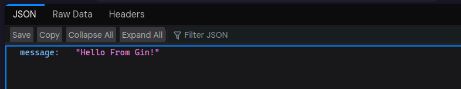

# Bab 3 : Dasar-Dasar Gin Framework

## 3.1 Bagian - Bagian Dasar Framework Gin

Sebelum masuk ke detail, ada baiknya mehami dulu bagian-bagian penting dari kode Gin yang sering ditemukan saat memulai proyek :

### 3.1.1 Import Package Gin

```go
import (
	"net/http"
	"github.com/gin-gonic/gin"
)
```
Berikut penjelasan singkat :

- `net/hhtp` :  Digunakan untuk konstanta status HTTP seperti http.StatusOK
- `github.com/gin-gonic/gin` : Import package utama framework Gin
  
Setiap aplikasi Go memerlukan package yang relevan untuk fungsionalitasnya. `net/http` adalah package standar Go yang menyediakan fungsi dasar untuk protokol HTTP, termasuk kode status (misalnya, 200 OK, 404 Not Found). 

Sementara itu, `github.com/gin-gonic/gin` adalah package Gin itu sendiri, yang berisi semua tools dan fungsi yang diperlukan untuk membangun API dengan Gin.

### 3.1.2 Iinsialisasi Gin Engine

```go
func main() {
	r := gin.Default()
	
    // ... kode routing lainnya ...
}
```

Baris r := gin.Default() adalah titik awal aplikasi Gin, dengan keterangan berikut :
1. `gin.Default()` : Ini adalah fungsi yang mengembalikan instance dari `*gin.Engine`. `*gin.Engine` adalah objek utama yang akan digunakan untuk mendefinisikan rute, middleware, dan menjalankan server. `Default()` secara otomatis menyertakan dua middleware bawaan yang sangat berguna :
   - Logger : Menampilkan log dari setiap permintaan yang masuk ke konsol, sangat membantu untuk debugging.
    - Recovery : Menangkap panic (kesalahan runtime) yang mungkin terjadi selama pemrosesan permintaan, sehingga server tidak crash sepenuhnya dan bisa mengirimkan respons error yang sesuai ke klien.
2. Jika ingin memulai dengan engine yang benar-benar "kosong" tanpa middleware bawaan, bisa gunakan `r := gin.New()`. Namun, `gin.Default()` adalah pilihan paling umum dan direkomendasikan untuk sebagian besar kasus.
3. `r`: Ini adalah variabel (umumnya dinamakan r untuk router) yang menyimpan instance `*gin.Engine`. Semua definisi rute dan konfigurasi server akan melekat pada objek `r` ini.

### 3.2.3 Menjalankan Server

```go
func main() {
	// ... kode inisialisasi dan routing ...
	r.Run(":8080")
}
```

`r.Run(":8080")` adalah baris terakhir yang harus dipanggil di fungsi main Gin. Fungsi ini :

- Memulai server HTTP Gin.
- endengarkan permintaan masuk pada alamat dan port yang ditentukan (dalam contoh ini, `:8080` berarti mendengarkan di semua interface jaringan yang tersedia pada port 8080).
- Aplikasi akan terus berjalan dan menunggu permintaan hingga dihentikan secara manual (misalnya, dengan Ctrl+C).

Untuk memahami kode dasar Go Gin bisa menggunakan kode dasar ini :

3.2-test.go

```go
package main

import (
    "net/http"

    "github.com/gin-gonic/gin"
)

func main() {
    // Inisialisasi Gin dengan middleware default (Logger dan Recovery)
    r := gin.Default()

    // Definisikan route untuk path root ("/") dengan metode GET
    r.GET("/", func(c *gin.Context) {
        // Kirim respons JSON dengan status 200 OK
        c.JSON(http.StatusOK, gin.H{
            "message": "Hello From Gin!",
        })
    })

    // Jalankan server di port 8080
    r.Run(":8080")
}
```
Jalankan dengaan menggunakan perintah : 

```bash
$ go run 3.2-BasicGin.go
```
Lalu buka browser dengan URL :

```url
localhost:port
```

atau karena port tadi yang di code adalah 8080 :

```
localhost:8080
```

Maka akan keluar dengan di browser seperti yang ada di gambar : 



Dan pada log terminal akan menampilkan data transaksi :

```bash
$ go run 3.2-BasicGin.go 
[GIN-debug] [WARNING] Creating an Engine instance with the Logger and Recovery middleware already attached.

[GIN-debug] [WARNING] Running in "debug" mode. Switch to "release" mode in production.
 - using env:   export GIN_MODE=release
 - using code:  gin.SetMode(gin.ReleaseMode)

[GIN-debug] GET    /                         --> main.main.func1 (3 handlers)
[GIN-debug] [WARNING] You trusted all proxies, this is NOT safe. We recommend you to set a value.
Please check https://pkg.go.dev/github.com/gin-gonic/gin#readme-don-t-trust-all-proxies for details.
[GIN-debug] Listening and serving HTTP on :8080
[GIN] 2025/07/01 - 15:46:55 | 200 |      36.007µs |       127.0.0.1 | GET      "/"
[GIN] 2025/07/01 - 15:46:55 | 404 |       1.122µs |       127.0.0.1 | GET      "/favicon.ico"
```

Test telah berhasil, terlihat terdapat transaksi, dan di repository sudah di sediakan source code tinggal buka [3.2-BasicGin.go]()


## 3.3 Routing

### 3.3.1 Basic routing (GET, POST, PUT, DELETE)

Setiap permintaan HTTP memiliki metode atau verb yang menunjukkan jenis operasi yang ingin dilakukan klien. Gin menyediakan fungsi yang sesuai untuk setiap metode ini, memungkinkan kita untuk mendefinisikan handler atau fungsi yang akan dieksekusi ketika permintaan dengan metode dan path tertentu diterima. Berikut adalah contoh penggunaan metode routing dasar di Gin :

#### 3.2.1.1 GET Method

Metode GET digunakan untuk meminta data dari sumber daya tertentu. Ini adalah metode yang paling umum digunakan dan biasanya digunakan untuk mengambil halaman web, gambar, atau data API.

```go
package main

import (
    "net/http"
    "github.com/gin-gonic/gin"
)

func main() {
    router := gin.Default()
    // Mendefinisikan route untuk metode GET di path "/welcome"
    router.GET("/welcome", func(c *gin.Context) {
        c.JSON(http.StatusOK, gin.H{
            "message": "Selamat datang di server Gin!",
        })
    })
    router.Run(":8080")
}
```
Jadi ketika 

#### 3.2.1.2 POST Method

Metode POST digunakan untuk mengirim data dari pengguna ke server untuk membuat sumber daya baru. Data yang dikirim biasanya berada di dalam body dari permintaan (request body).

```go
package main

import (
    "net/http"
    "github.com/gin-gonic/gin"
)

func main() {
    router := gin.Default()
    // Mendefinisikan route untuk metode POST di path "/users"
    router.POST("/users", func(c *gin.Context) {
        // Logika untuk membuat user baru akan ada di sini
        c.JSON(http.StatusCreated, gin.H{
            "message": "User berhasil dibuat.",
        })
    })
    router.Run(":8080")
}
```

#### 3.2.1.3 PUT Method

Metode PUT digunakan untuk memperbarui sumber daya yang sudah ada di server. Biasanya, permintaan PUT menyertakan ID dari sumber daya yang akan diubah di URL dan data baru di dalam request body.

```go
package main

import (
    "net/http"
    "github.com/gin-gonic/gin"
)

func main() {
    router := gin.Default()
    // Mendefinisikan route untuk metode PUT di path "/users/:id"
    // :id adalah parameter dinamis
    router.PUT("/users/:id", func(c *gin.Context) {
        id := c.Param("id") // Mengambil ID dari URL
        // Logika untuk memperbarui user dengan ID tertentu
        c.JSON(http.StatusOK, gin.H{
            "message": "User dengan ID " + id + " berhasil diperbarui.",
        })
    })
    router.Run(":8080")
}
```

#### 3.2.1.4 DELETE Method

Metode DELETE digunakan untuk menghapus sumber daya tertentu dari server. Sama seperti PUT, permintaan DELETE biasanya menyertakan ID dari sumber daya yang akan dihapus di URL.

```go
package main

import (
    "net/http"
    "github.com/gin-gonic/gin"
)

func main() {
    router := gin.Default()
    // Mendefinisikan route untuk metode DELETE di path "/users/:id"
    router.DELETE("/users/:id", func(c *gin.Context) {
        id := c.Param("id") // Mengambil ID dari URL
        // Logika untuk menghapus user dengan ID tertentu
        c.JSON(http.StatusOK, gin.H{
            "message": "User dengan ID " + id + " berhasil dihapus.",
        })
    })
    router.Run(":8080")
}
```


### 3.2.2 Route Parameters dan ery parameters

Seringkali, kita perlu menangani permintaan yang bervariasi berdasarkan data spesifik dalam URL. Gin menyediakan dua cara utama untuk menangani ini yaitu Route Parameters dan Query Parameters.

#### 3.2.2.1 Route Parameters

#### 3.2.2.2 Query Parameters

### 3.2.3 Route groups dan middlewares

### 3.2.4 Static file serving

## 3.2 Request Handling

### 3.2.1 Binding request data (JSON, Form, Query)

### 3.2.2 Request validation

### 3.2.3 Response formatting (JSON, XML, HTML)

### 3.2.4 Error handling patterns