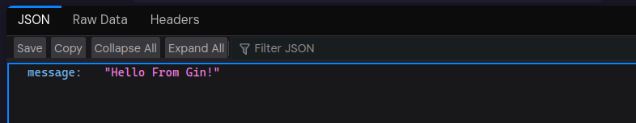
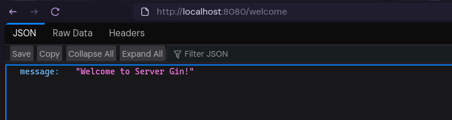
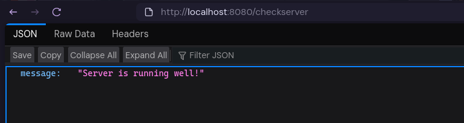
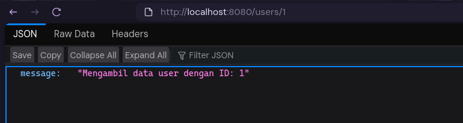

# Bab 3 : Dasar-Dasar Gin Framework

## 3.1 Bagian - Bagian Dasar Framework Gin

Sebelum masuk ke detail, ada baiknya mehami dulu bagian-bagian penting dari kode Gin yang sering ditemukan saat memulai proyek :

### 3.1.1 Import Package Gin

```go
import (
	"net/http"
	"github.com/gin-gonic/gin"
)
```

Berikut penjelasan singkat :

- `net/hhtp` :  Digunakan untuk konstanta status HTTP seperti `http.StatusOK`
- `github.com/gin-gonic/gin` : Import package utama framework Gin
  
Setiap aplikasi Go memerlukan package yang relevan untuk fungsionalitasnya. `net/http` adalah package standar Go yang menyediakan fungsi dasar untuk protokol HTTP, termasuk kode status (misalnya : `200 OK`, `404 Not Found`). 

Sementara itu, `github.com/gin-gonic/gin` adalah package Gin itu sendiri yang mengambil dari GitHub Repository Official Source Code yang berisi semua tools dan fungsi yang diperlukan untuk membangun API dengan Gin.

### 3.1.2 Inisialisasi Gin Engine

```go
func main() {
	r := gin.Default()
	
    // ... kode routing lainnya ...
}
```

Baris `r := gin.Default()` adalah titik awal aplikasi Gin, dengan keterangan berikut:

1. **`gin.Default()`**  
    Fungsi ini mengembalikan instance dari `*gin.Engine`. `gin.Engine` adalah objek utama yang digunakan untuk mendefinisikan rute, middleware, dan menjalankan server. `Default()` secara otomatis menyertakan dua middleware bawaan yang sangat berguna:
    - **Logger**: Menampilkan log dari setiap permintaan yang masuk ke konsol, sangat membantu untuk debugging.
    - **Recovery**: Menangkap panic (kesalahan runtime) yang mungkin terjadi selama pemrosesan permintaan, sehingga server tidak crash sepenuhnya dan bisa mengirimkan respons error yang sesuai ke klien.

2. Jika ingin memulai dengan engine yang benar-benar *kosong* tanpa middleware bawaan, bisa gunakan `r := gin.New()`. Namun, `gin.Default()` adalah pilihan paling umum dan direkomendasikan untuk sebagian besar kasus.

3. **`r`**  atau lainnya
   Ini adalah variabel (umumnya dinamakan `r` untuk router) yang menyimpan instance `*gin.Engine`. Semua definisi rute dan konfigurasi server akan melekat pada objek `r` ini.

### 3.1.3 Menjalankan Server

```go
func main() {
	// ... kode inisialisasi dan routing ...
	r.Run(":8080")
}
```

`r.Run(":8080")` adalah baris terakhir yang harus dipanggil di fungsi main Gin. Fungsi ini :

- Memulai server HTTP Gin.
- Mendengarkan permintaan masuk pada alamat dan port yang ditentukan (dalam contoh ini, `:8080` berarti mendengarkan di semua interface jaringan yang tersedia pada port 8080).
- Aplikasi akan terus berjalan dan menunggu permintaan hingga dihentikan secara manual (misalnya, dengan Ctrl+C).

Untuk memahami kode dasar Go Gin bisa menggunakan kode dasar ini :

3.1-BasicGin.go

```go
package main

import (
	"net/http"

	"github.com/gin-gonic/gin"
)

func main() {
	// Initialize Gin with default middleware (Logger and Recovery)
	r := gin.Default()

	// Define route for root path ("/") with GET method
	r.GET("/", func(c *gin.Context) {
		// Send JSON response with status 200 OK
		c.JSON(http.StatusOK, gin.H{
			"message": "Hello From Gin!",
		})
	})

	// Run server on port 8080
	r.Run(":8080")
}
```

Jalankan dengaan menggunakan perintah : 

```bash
$ go run 3.1-BasicGin.go
```
Lalu buka browser dengan URL :

```url
http://localhost:port/
```

karena port yang ada di code adalah `8080`, maka akses dengan menggunakan :

```
http://localhost:8080/
```

Maka akan keluar dengan di browser seperti ini : 



Dan pada log terminal akan menampilkan data transaksi :

```bash
$ go run 3.1-BasicGin.go 
[GIN-debug] [WARNING] Creating an Engine instance with the Logger and Recovery middleware already attached.

[GIN-debug] [WARNING] Running in "debug" mode. Switch to "release" mode in production.
 - using env:   export GIN_MODE=release
 - using code:  gin.SetMode(gin.ReleaseMode)

[GIN-debug] GET    /                         --> main.main.func1 (3 handlers)
[GIN-debug] [WARNING] You trusted all proxies, this is NOT safe. We recommend you to set a value.
Please check https://pkg.go.dev/github.com/gin-gonic/gin#readme-don-t-trust-all-proxies for details.
[GIN-debug] Listening and serving HTTP on :8080
[GIN] 2025/07/01 - 15:46:55 | 200 |      36.007µs |       127.0.0.1 | GET      "/"
[GIN] 2025/07/01 - 15:46:55 | 404 |       1.122µs |       127.0.0.1 | GET      "/favicon.ico"
```

Test telah berhasil, juga terlihat terdapat transaksi pada jaringan :

```bash
[GIN] 2025/07/01 - 15:46:55 | 200 |      36.007µs |       127.0.0.1 | GET      "/"
[GIN] 2025/07/01 - 15:46:55 | 404 |       1.122µs |       127.0.0.1 | GET      "/favicon.ico"
```

Untuk mencoba code, bisa salin kode di atas atau akses pada repository yang sudah disediakan di [3.1-BasicGin.go](../../source-code/chapter3/3.1-BasicGin.go)

## 3.2 Routing

### 3.2.1 Basic routing (GET, POST, PUT, DELETE)

Setiap permintaan HTTP memiliki metode atau verb yang menunjukkan jenis operasi yang ingin dilakukan klien. Gin menyediakan fungsi yang sesuai untuk setiap metode ini, memungkinkan kita untuk mendefinisikan handler atau fungsi yang akan dieksekusi ketika permintaan dengan metode dan path tertentu diterima. Berikut adalah contoh penggunaan metode routing dasar di Gin :

#### 3.2.1.1 GET Method

Metode GET digunakan untuk meminta data dari sumber daya tertentu. Ini adalah metode yang paling umum digunakan dan biasanya digunakan untuk mengambil halaman web, gambar, atau data API.

3.2.1.1-1.TryGet.go

```go
package main

import (
    "net/http"

    "github.com/gin-gonic/gin"
)

func main() {
    router := gin.Default()
    router.GET("/welcome", func(c *gin.Context) {
        c.JSON(http.StatusOK, gin.H{
            "message": "Welcome to Server Gin!",
        })
    })
    router.Run(":8080")
}
```

Kode di atas akan bermakna, jika server mendapatkan `/welcome` pada browser maka server akan mengirmkan JSON message dengan status OK dan isi pada key `message` akan berisi `Welcome to Server Gin!`. Coba untuk run :

```bash
$ go run 3.2.1.1-1.TryGet.go
```

Ketika di akses dengan menggunakan URL `http://localhost:8080/welcome` akan mengeluarkan  :



Kita akan coba dengan menambah GET dengan routing `/checkserver' dengan pesan yang berbeda :

3.2.1.1-2.TryGet.go

```go
package main

import (
    "net/http"
    "github.com/gin-gonic/gin"
)

func main() {
    router := gin.Default()
    router.GET("/welcome", func(c *gin.Context) {
        c.JSON(http.StatusOK, gin.H{
            "message": "Welcome to Server Gin!",
        })
    })

    router.GET("/checkserver", func(c *gin.Context) {
        c.JSON(http.StatusOK, gin.H{
            "message": "Server is running well!",
        })
    })
    
    router.Run(":8080")
}
```

Kita coba jalankan :

```bash
$ go run 3.2.1.1-2.TryGet.go
```
Ketika di akses dengan akses lokasi 'http://localhost:8080/checkserver' maka akan nampak :



Jika akses di browser antara `http://localhost:8080/welcome` dan `http://localhost:8080/checkserver` maka pasti akan berbeda output yang di keluarkan :


Contoh kasus nyata lagi meminta data berdasarkan pada sebuah ID, kita panggil dengan penggunaan URL `http://localhost:8080/users/1` dengan kode :

3.2.1.1-3.TryGet.go

```go
package main

import (
    "net/http"
    "github.com/gin-gonic/gin"
)

func main() {
    router := gin.Default()
    // Define a route with dynamic parameters :id
    router.GET("/users/:id", func(c *gin.Context) {
        // Get the value of the 'id' parameter from the URL
        id := c.Param("id")
        c.JSON(http.StatusOK, gin.H{
            "message": "Getting user data with ID: " + id,
        })
    })
    router.Run(":8080")
}
```

> `id := c.Param("id")` merupakan dua entitas yang satu variable sementara untuk menyimpan ID (id) dan fungsi untuk mendapatkan data yang diinginkan (c.Param), dinamakan Route Parameter, untuk lebih lanjut akan di bahas di Sub bab 3.2.2.1. 

Maka ketika di panggil dengan `http://localhost:8080/user/1` maka akan menjawab :



Untuk mencoba code bisa mengakses [3.2.1.1-1.TryGet.go](../../source-code/chapter3/3.2.1.1-1.TryGet.go),[3.2.1.1-2.TryGet.go](../../source-code/chapter3/3.2.1.1-2.TryGet.go), dan [3.2.1.1-3.TryGet.go](../../source-code/chapter3/3.2.1.1-3.TryGet.go)

#### 3.2.1.2 POST Method

Metode POST digunakan untuk mengirim data dari pengguna ke server untuk membuat sumber daya baru. Data yang dikirim biasanya berada di dalam body dari permintaan (request body). 

> Keterangan : Pengujian POST memerlukan tools khusus seperti `cURL` pada terminal, Postman, atau Insomnia untuk mengirim permintaan.

3.2.1.2-1.TryPost.go

```go
package main

import (
    "net/http"
    "github.com/gin-gonic/gin"
)

func main() {
    router := gin.Default()
    // Define a route for the POST method in the path "/create-user"
    router.POST("/create-user", func(c *gin.Context) {
        // ... Logic to create a new user will go here ...
        // For now, we just send a confirmation response
        c.JSON(http.StatusCreated, gin.H{
            "message": "User created successfully.",
        })
    })
    router.Run(":8080")
}
```

> Untuk logika membuat user akan menyesuaikan dengan arsitektur dari sistem masing masing, code di atas hanya memberikan pesan bahwa fungsi POST berhasil, dan peneysuaian bisa di lihat pada bagian materi selanjutnya.

Kode di atas akan membuat sebuah endpoint `/create-user` yang hanya menerima metode POST. Jika endpoint ini diakses dengan metode POST, server akan merespons dengan status `201 Created` dan sebuah pesan JSON.

Jalankan server :

```bash
$ go run 3.2.1.2-1.TryPost.go
```

Untuk mengujinya, gunakan `cURL` di terminal :

```bash
$ curl -X POST http://localhost:8080/create-user
```

Dan akan mendapatkan output JSON berikut :

```json
{"message":"User created successfully."}
```

Tapi kalau kita paksa akses pakai GET, maka akan menghasilkan output berikut :

```bash
$ curl -X GET http://localhost:8080/create-user
404 page not found
```

`/create-user` hanya menerima POST, jadi ketika menggunakan GET tidak akan bisa berjalan sesuai dengan kode. Sama seperti GET, kita bisa mendefinisikan beberapa route POST dalam satu aplikasi. Oke, buat lagi mungkin yang spesifik :

3.2.1.2-2.TryPost.go

```go
package main

import (
    "net/http"
    "github.com/gin-gonic/gin"
)

func main() {
    router := gin.Default()
    
    // Endpoint for making new users
    router.POST("/create-user", func(c *gin.Context) {
        // Example : receive username data from form or JSON (simplified)
        name := c.DefaultPostForm("name", "Anonymous")
        c.JSON(http.StatusCreated, gin.H{
            "message": "User created successfully.",
            "user":    name,
        })
    })

    // Endpoint for making new products
    router.POST("/create-product", func(c *gin.Context) {
        // Example : receive product name data from form or JSON (simplified)
        product := c.DefaultPostForm("product", "Unknown Product")
        c.JSON(http.StatusCreated, gin.H{
            "message": "Product created successfully.",
            "product": product,
        })
    })
    
    router.Run(":8080")
}
```

Dengan kode di atas, Anda dapat menguji POST dengan data yang berbeda untuk setiap endpoint. Misalnya, untuk membuat user baru dengan nama:

```bash
$ curl -X POST -d "name=Andi" http://localhost:8080/create-user
```

Output :

```json
{"message":"User created successfully.","user":"Andi"}
```

Untuk membuat produk baru dengan nama produk :

```bash
$ curl -X POST -d "product=Laptop" http://localhost:8080/create-product
```

Output:

```json
{"message":"Product created successfully.","product":"Laptop"}
```

Jika tidak mengirim data, maka akan menggunakan nilai default yang sudah disediakan. Ini menunjukkan bagaimana POST dapat digunakan untuk menerima data dari client dan memberikan respons yang sesuai berdasarkan data yang dikirimkan.

Ini menunjukkan bagaimana Gin dapat dengan mudah memetakan permintaan POST ke handler yang berbeda berdasarkan path URL. Untuk source code bisa dilihat di [3.2.1.2-1.TryPost.go](../../source-code/chapter3/3.2.1.2-1.TryPost.go) dan [3.2.1.2-2.TryPost.go](../../source-code/chapter3/3.2.1.2-2.TryPost.go).

#### 3.2.1.3 PUT Method

Metode PUT digunakan untuk memperbarui sumber daya yang sudah ada di server. Mirip seperti POST namun berbeda. Jika POST digunakan untuk membuat data baru, maka PUT digunakan untuk memperbarui data yang sudah ada atau membuat data jika belum ada (idempotent). Dengan kata lain, POST menambah data baru, sedangkan PUT mengganti seluruh data pada resource yang dituju. Biasanya, permintaan PUT menyertakan ID dari sumber daya yang akan diubah di URL dan data baru di dalam request body.

> Keterangan : Sama seperti POST, pengujian PUT memerlukan tools khusus seperti `cURL`, Postman, atau Insomnia.

3.2.1.3-1.TryPut.go

```go
package main

import (
    "net/http"

    "github.com/gin-gonic/gin"
)

func main() {
    router := gin.Default()
    // Defines a route for the PUT method at the path "/users/:id"
    // :id is a dynamic parameter that can be taken from the URL
    router.PUT("/users/:id", func(c *gin.Context) {
        id := c.Param("id") // Retrieving the "id" parameter value from the URL
        // The logic for updating a user with a specific ID will be here.
        c.JSON(http.StatusOK, gin.H{
            "message": "User with ID " + id + " successfully updated.",
        })
    })
    router.Run(":8080")
}
```

> `id := c.Param("id")` merupakan dua entitas yang satu variable sementara untuk menyimpan ID (id) dan fungsi untuk mendapatkan data yang diinginkan (c.Param), dinamakan Route Parameter, untuk lebih lanjut akan di bahas di Sub bab 3.2.2.1. 

> Untuk logika merubah isi user akan menyesuaikan dengan arsitektur dari sistem masing masing, code di atas hanya memberikan pesan bahwa fungsi PUT berhasil, dan peneysuaian bisa di lihat pada bagian materi selanjutnya.

Kode di atas mendefinisikan endpoint `/users/:id` yang merespons metode PUT. Bagian `:id` adalah *route parameter* yang memungkinkan URL menjadi dinamis. Nilai dari `id` bisa diambil menggunakan `c.Param("id")`.

Jalankan server :

```bash
$ go run 3.2.1.3-1.TryPut.go
```

Untuk mengujinya, gunakan `cURL` dan berikan ID user yang ingin di-update, misalnya `123` :

```bash
$ curl -X PUT http://localhost:8080/users/123
```

Dan akan mendapatkan output JSON berikut :

```json
{"message":"User dengan ID 123 berhasil diperbarui."}
```

3.2.1.3-2.TryPut.go

Berikut contoh implementasi PUT yang lebih unik dan menjelaskan penggunaan PUT untuk memperbarui data produk berdasarkan ID, sekaligus menerima data baru dari client (misal nama produk) :

```go
package main

import (
    "net/http"
    "github.com/gin-gonic/gin"
)

func main() {
    router := gin.Default()

    // Endpoint to update product data based on ID
    router.PUT("/products/:id", func(c *gin.Context) {
        id := c.Param("id")
        // Get new product name data from form or JSON (simple)
        newName := c.DefaultPostForm("name", "Produk Tanpa Nama")
        c.JSON(http.StatusOK, gin.H{
            "message": "Produk dengan ID " + id + " berhasil diperbarui.",
            "new_name": newName,
        })
    })

    router.Run(":8080")
}
```

Jalankan server :

```bash
$ go run 3.2.1.3-2.TryPut.go
```

Untuk menguji endpoint PUT ini, gunakan perintah berikut dengan data nama produk baru :

```bash
$ curl -X PUT -d "name=Smartphone Baru" http://localhost:8080/products/abc-456
```

Sehingga, output yang dihasilkan :

```json
{"message":"Produk dengan ID abc-456 berhasil diperbarui.","new_name":"Smartphone Baru"}
```

Jika tidak mengirim data `name`, maka akan menggunakan nilai default :

```bash
$ curl -X PUT http://localhost:8080/products/abc-456
```

Output:

```json
{"message":"Produk dengan ID abc-456 berhasil diperbarui.","new_name":"Produk Tanpa Nama"}
```

Dengan demikian, contoh ini menunjukkan bahwa PUT digunakan untuk memperbarui data yang sudah ada, dan data baru dapat dikirim melalui request body. 

Untuk source code lengkap dapat dilihat di [3.2.1.3-1.TryPut.go](../../source-code/chapter3/3.2.1.3-1.TryPut.go) dan [3.2.1.3-2.TryPut.go](../../source-code/chapter3/3.2.1.3-2.TryPut.go).


#### 3.2.1.4 DELETE Method

Metode DELETE digunakan untuk menghapus sumber daya tertentu dari server. Sama seperti PUT, permintaan DELETE biasanya menyertakan ID dari sumber daya yang akan dihapus di URL. DELETE digunakan ketika kita ingin menghapus data secara permanen dari sistem, misalnya menghapus user, produk, atau entitas lain berdasarkan ID.

> Keterangan: Pengujian DELETE memerlukan tools khusus seperti `cURL`, Postman, atau Insomnia.

3.2.1.4-1.TryDelete.go

```go
package main

import (
    "net/http"
    "github.com/gin-gonic/gin"
)

func main() {
    router := gin.Default()
    // Defines a route for the DELETE method on the path "/users/:id"
    router.DELETE("/users/:id", func(c *gin.Context) {
        id := c.Param("id") // Retrieving ID from URL
        // Logic to delete user with specific ID
        c.JSON(http.StatusOK, gin.H{
            "message": "User with ID " + id + " successfully deleted.",
        })
    })
    router.Run(":8080")
}
```

> `id := c.Param("id")` merupakan dua entitas yang satu variable sementara untuk menyimpan ID (id) dan fungsi untuk mendapatkan data yang diinginkan (c.Param), dinamakan Route Parameter, untuk lebih lanjut akan di bahas di Sub bab 3.2.2.1. 

> Untuk logika menghapus user akan menyesuaikan dengan arsitektur dari sistem masing masing, code di atas hanya memberikan pesan bahwa fungsi PUT berhasil, dan peneysuaian bisa di lihat pada bagian materi selanjutnya.

Kode di atas mendefinisikan endpoint `/users/:id` yang hanya menerima metode DELETE. Bagian `:id` adalah *route parameter* yang memungkinkan URL menjadi dinamis. Nilai dari `id` bisa diambil menggunakan `c.Param("id")`.

Jalankan server :

```bash
$ go run 3.2.1.4-1.TryDelete.go
```

Untuk menguji endpoint DELETE, gunakan `cURL` di terminal:

```bash
$ curl -X DELETE http://localhost:8080/users/42
```

Output yang dihasilkan:

```json
{"message":"User dengan ID 42 berhasil dihapus."}
```

Sama seperti metode lain, kita juga bisa mendefinisikan beberapa endpoint DELETE untuk sumber daya berbeda. Berikut contoh untuk menghapus produk berdasarkan ID :

3.2.1.4-2.TryDelete.go

```go
package main

import (
    "net/http"
    "github.com/gin-gonic/gin"
)

func main() {
    router := gin.Default()
    
    router.DELETE("/users/:id", func(c *gin.Context) {
        id := c.Param("id")
        c.JSON(http.StatusOK, gin.H{
            "message": "User dengan ID " + id + " berhasil dihapus.",
        })
    })

    router.DELETE("/products/:productId", func(c *gin.Context) {
        productId := c.Param("productId")
        c.JSON(http.StatusOK, gin.H{
            "message": "Produk dengan ID " + productId + " berhasil dihapus.",
        })
    })
    
    router.Run(":8080")
}
```

Jalankan server:

```bash
$ go run 3.2.1.4-2.TryDelete.go
```

Untuk menguji endpoint `/products/:productId`, gunakan perintah berikut:

```bash
$ curl -X DELETE http://localhost:8080/products/abc-123
```

Output:

```json
{"message":"Produk dengan ID abc-123 berhasil dihapus."}
```

Dengan demikian, metode DELETE pada Gin sangat mudah digunakan untuk menghapus berbagai jenis sumber daya berdasarkan parameter dinamis di URL. Untuk source code lengkap dapat dilihat di [3.2.1.4-1.TryDelete.go](../../source-code/chapter3/3.2.1.4-1.TryDelete.go) dan [3.2.1.4-2.TryDelete.go](../../source-code/chapter3/3.2.1.4-2.TryDelete.go).

### 3.2.2 Route Parameters dan Query Parameters

Seringkali, kita perlu menangani permintaan yang bervariasi berdasarkan data spesifik dalam URL. Gin menyediakan dua cara utama untuk menangani ini yaitu Route Parameters dan Query Parameters.

#### 3.2.2.1 Route Parameters

Route parameters adalah bagian dari URL yang memungkinkan kita menangkap nilai dinamis pada path tertentu. Biasanya, route parameters didefinisikan dengan awalan titik dua (`:`) di dalam pola rute. Contohnya, pada endpoint `/users/:id`, bagian `:id` akan menangkap nilai apa pun yang diberikan pada posisi tersebut di URL, misalnya `/users/5` atau `/users/abc123`.

Route parameters sangat berguna ketika kita ingin mengakses data spesifik berdasarkan identitas unik, seperti ID user, kode produk, atau slug artikel. Gunakan route parameters jika nilai tersebut merupakan bagian utama dari identitas sumber daya yang diakses.

Berikut contoh implementasi route parameters di Gin :

3.2.2.1-1.TryRouteParameters.go

```go
package main

import (
    "net/http"
    "github.com/gin-gonic/gin"
)

func main() {
    r := gin.Default()

    // Defining a route with the dynamic parameter ":id"
    r.GET("/users/:id", func(c *gin.Context) {
        id := c.Param("id") // Retrieves the "id" parameter value from the URL
        c.JSON(http.StatusOK, gin.H{
            "message": "Detail user dengan ID: " + id,
        })
    })

    r.Run(":8080")
}
```

`id := c.Param("id")` berarti mengambil nilai parameter bernama "id" dari URL pada objek context (`c`), lalu menyimpannya ke variabel `id`. Pada framework web seperti Gin di Go, ini digunakan untuk mendapatkan data dinamis dari bagian route, misalnya pada endpoint `/users/:id`, sehingga jika diakses `/users/5`, maka `id` akan berisi `"5"`. Cara ini sangat berguna untuk menangani permintaan berdasarkan identitas unik yang diberikan langsung di path URL.
Ketika coba dijalankan dan diakses:

```bash
$ go run 3.2.2.1-1.TryRouteParameters.go
```

Lalu buka browser atau gunakan cURL untuk mengakses endpoint, misalnya:

```bash
$ curl http://localhost:8080/users/42
```

Maka akan mendapatkan respons JSON :

```json
{"message":"Detail user dengan ID: 42"}
```

Pada contoh di atas, jika ada permintaan ke `/users/42`, maka nilai `42` akan diambil melalui `c.Param("id")` dan dapat digunakan di dalam handler. Dengan demikian, route parameters memudahkan pembuatan endpoint yang fleksibel dan dinamis sesuai kebutuhan aplikasi.

Selain `id`, kita bisa menggunakan nama parameter lain sesuai kebutuhan, misalnya `username`, `slug`, atau `productCode`. Berikut contoh implementasi route parameter dengan nama `username`:

3.2.2.1-2.TryRouteParametersUsername.go

```go
package main

import (
    "net/http"
    "github.com/gin-gonic/gin"
)

func main() {
    r := gin.Default()

    // Define a route with the dynamic parameter ":username"
    r.GET("/profile/:username", func(c *gin.Context) {
        username := c.Param("username")
        c.JSON(http.StatusOK, gin.H{
            "message": "Profile with username : " + username,
        })
    })

    r.Run(":8080")
}
```

Jalankan server :

```bash
$ go run 3.2.2.1-2.TryRouteParametersUsername.go
```

Akses di browser atau cURL :

```bash
$ curl http://localhost:8080/profile/johndoe
```

Maka output :

```json
{"message":"Profil user dengan username : johndoe"}
```

Dengan demikian, Anda bisa menggunakan nama parameter apa pun sesuai kebutuhan pada route Gin.
Untuk mencoba Route Parameters, bisa menggunakan kode di atas, atau akses source code pada [3.2.2.1-1.TryRouteParameters.go](../../source-code/chapter3/3.2.2.1-1.TryRouteParameters.go) dan [3.2.2.1-2.TryRouteParametersUsername.go](../../source-code/chapter3/3.2.2.1-2.TryRouteParametersUsername.go).

#### 3.2.2.2 Query Parameters

Query parameters adalah pasangan kunci-nilai yang ditempatkan di akhir URL setelah tanda tanya (`?`). Mereka digunakan untuk mengirimkan data tambahan yang bersifat opsional, seperti filter, urutan, pencarian, atau paginasi. Contoh penggunaan query parameters pada URL adalah :

```
/products?category=elektronik&sort=price_asc
```

Pada contoh di atas, `category` dan `sort` adalah query parameters yang dapat digunakan untuk memfilter produk berdasarkan kategori dan mengurutkan hasil berdasarkan harga.

Kapan menggunakan query parameters? Gunakan query parameters ketika ingin memberikan opsi tambahan pada permintaan, seperti :

- Memfilter data (misal : `?status=active`)
- Mengurutkan hasil (misal : `?sort=price_desc`)
- Melakukan pencarian (misal : `?q=laptop`)
- Paginasi (misal : `?page=2&limit=20`)

Query parameters tidak digunakan untuk mengidentifikasi sumber daya utama, melainkan untuk mengatur bagaimana data dikembalikan oleh server.
Berikut contoh kode penggunaan query parameters pada Gin :

3.2.2.2.TryQueryParameters.go

```go
package main

import (
    "net/http"
    "github.com/gin-gonic/gin"
)

func main() {
    r := gin.Default()

    // Defines a route that accepts query parameters
    r.GET("/products", func(c *gin.Context) {
        category := c.Query("category") // Get the value of the query parameter "category"
        sort := c.Query("sort") // Get the value of the query parameter "sort"

        if category != "" && sort != "" {
            c.JSON(http.StatusOK, gin.H{
                "message": "Getting products in category: " + category + " with sort: " + sort,
            })
        } else if category != "" {
            c.JSON(http.StatusOK, gin.H{
                "message": "Getting products in category: " + category,
            })
        } else if sort != "" {
            c.JSON(http.StatusOK, gin.H{
                "message": "Getting products with sort: " + sort,
            })
        } else {
            c.JSON(http.StatusOK, gin.H{
                "message": "Getting all products",
            })
        }

    r.Run(":8080")
}
```

Pada kode di atas, handler `/products` akan membaca query parameters `category` dan `sort` menggunakan fungsi `c.Query("nama_parameter")`. Jika parameter tidak ada, maka akan bernilai string kosong. Anda juga bisa menggunakan `c.DefaultQuery("nama_parameter", "nilai_default")` untuk memberikan nilai default jika parameter tidak dikirimkan.

Jalankan server :

```bash
$ go run 3.2.2.2.TryQueryParameters.go
```

Lalu akses endpoint dengan berbagai kombinasi query parameters:

- Tanpa query parameter
  ```
  http://localhost:8080/products
  ```
  Output : `{"message":"Getting all products"}`

- Dengan satu query parameter
  ```
  http://localhost:8080/products?category=electronic
  ```
  Output    : `{"message":"Getting products in category: electronic"}`

- Dengan dua query parameter
  ```
  http://localhost:8080/products?category=electronic&sort=price_asc
  ```
  Output: `{"message":"Getting products in category: electronic with sort: price_asc"}`

Dengan demikian, query parameters sangat berguna untuk membuat endpoint yang fleksibel dan dapat menangani berbagai kebutuhan filtering, sorting, dan pencarian data tanpa harus membuat banyak endpoint berbeda.

Untuk mencoba kode di atas, Anda bisa menyalin kode atau mengakses source code pada [3.2.2.2.TryQueryParameters.go](../../source-code/chapter3/3.2.2.2.TryQueryParameters.go).

### 3.2.3 Route Groups dan Middlewares


### 3.2.4 Static file serving

## 3.2 Request Handling

### 3.2.1 Binding request data (JSON, Form, Query)

### 3.2.2 Request validation

### 3.2.3 Response formatting (JSON, XML, HTML)

### 3.2.4 Error handling patterns